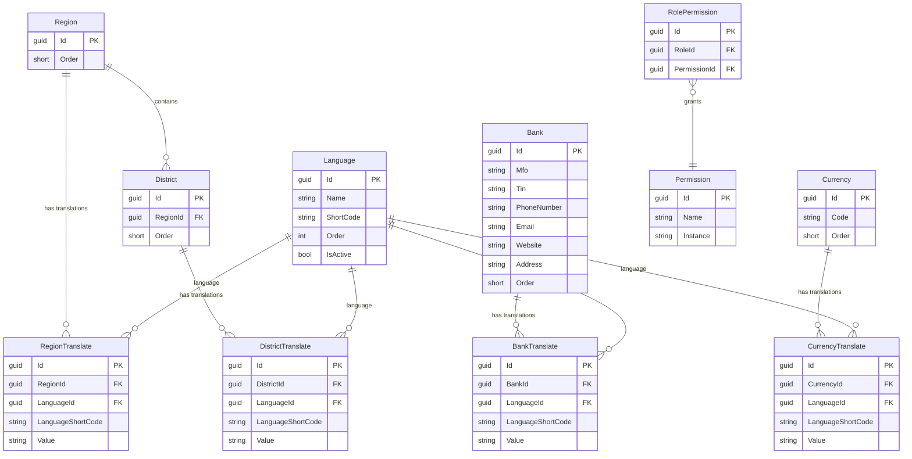

# Common Module — Entity Relationship Diagram

## Overview

The Common module (`commons` schema) provides **shared reference data** consumed by all other modules: geographic data (regions, districts), localization (languages), financial data (banks, currencies), and authorization primitives (role-permissions).

---

## Entities

### Language

Central entity used across the entire system for i18n.

| Column       | Type        | Constraints         |
|-------------|-------------|---------------------|
| Id          | `Guid`      | PK (from `Entity`)  |
| Name        | `string`    | MaxLength(100)      |
| ShortCode   | `string`    | MaxLength(10)       |
| Order       | `int`       |                     |
| IsActive    | `bool`      | Default `true`      |
| IsDeleted   | `bool`      | Global filter       |

> [!NOTE]
> `Language` has **no translate table** — it is the root of the translation system itself (referenced by all `*Translate` tables via `LanguageId` + `LanguageShortCode`).

---

### Bank ↔ BankTranslate

| Bank             | Type        | Constraints         |
|------------------|-------------|---------------------|
| Id               | `Guid`      | PK                  |
| Mfo              | `string`    | Required, MaxLen(20)|
| Tin              | `string?`   | MaxLen(20)          |
| PhoneNumber      | `string?`   | MaxLen(20)          |
| Email            | `string?`   | MaxLen(100)         |
| Website          | `string?`   | MaxLen(200)         |
| Address          | `string?`   | MaxLen(500)         |
| Order            | `short`     |                     |

| BankTranslate      | Type        | Constraints         |
|--------------------|-------------|---------------------|
| Id                 | `Guid`      | PK                  |
| BankId             | `Guid`      | FK → Bank           |
| LanguageId         | `Guid`      | FK → Language       |
| LanguageShortCode  | `string`    | Required, MaxLen(10)|
| Value              | `string`    | Required, MaxLen(200)|

---

### Currency ↔ CurrencyTranslate

| Currency | Type        | Constraints         |
|----------|-------------|---------------------|
| Id       | `Guid`      | PK                  |
| Code     | `string?`   | MaxLen(10)          |
| Order    | `short`     |                     |

| CurrencyTranslate    | Type        | Constraints         |
|----------------------|-------------|---------------------|
| Id                   | `Guid`      | PK                  |
| CurrencyId           | `Guid`      | FK → Currency       |
| LanguageId           | `Guid`      | FK → Language       |
| LanguageShortCode    | `string`    | Required, MaxLen(10)|
| Value                | `string`    | Required, MaxLen(100)|

---

### Region ↔ RegionTranslate

| Region | Type        | Constraints |
|--------|-------------|-------------|
| Id     | `Guid`      | PK          |
| Order  | `short`     |             |

`LanguageValues` is `[NotMapped]` — used only in-memory for passing translates to domain events.

| RegionTranslate      | Type        | Constraints         |
|----------------------|-------------|---------------------|
| Id                   | `Guid`      | PK                  |
| RegionId             | `Guid`      | FK → Region         |
| LanguageId           | `Guid`      | FK → Language       |
| LanguageShortCode    | `string`    | Required, MaxLen(10)|
| Value                | `string`    | Required, MaxLen(200)|

---

### District ↔ DistrictTranslate

| District   | Type        | Constraints    |
|-----------|-------------|----------------|
| Id        | `Guid`      | PK             |
| RegionId  | `Guid`      | FK → Region    |
| Order     | `short`     |                |

| DistrictTranslate    | Type        | Constraints         |
|----------------------|-------------|---------------------|
| Id                   | `Guid`      | PK                  |
| DistrictId           | `Guid`      | FK → District       |
| LanguageId           | `Guid`      | FK → Language       |
| LanguageShortCode    | `string`    | Required, MaxLen(10)|
| Value                | `string`    | Required, MaxLen(200)|

---

### RolePermission

Join table bridging roles (from Identity) to permissions (from Core).

| Column       | Type   | Constraints      |
|-------------|--------|------------------|
| Id          | `Guid` | PK               |
| RoleId      | `Guid` | FK (Identity)    |
| PermissionId| `Guid` | FK → Permission  |

---

## ER Diagram

---

## Domain Events

All events implement `IPrePublishDomainEvent` (processed before `SaveChangesAsync`).

| Entity   | Event                               | Purpose                                    |
|----------|-------------------------------------|--------------------------------------------|
| Bank     | `CreateOrUpdateBankDomainEvent`     | Upserts `BankTranslate` records            |
| Bank     | `RemoveBankDomainEvent`             | Soft-deletes `BankTranslate` records       |
| Currency | `CreateOrUpdateCurrencyDomainEvent` | Upserts `CurrencyTranslate` records        |
| Currency | `RemoveCurrencyDomainEvent`         | Soft-deletes `CurrencyTranslate` records   |
| Region   | `UpsertRegionDomainEvent`           | Upserts `RegionTranslate` records          |
| Region   | `RemoveRegionDomainEvent`           | Soft-deletes `RegionTranslate` records     |
| District | `UpsertDistrictDomainEvent`         | Upserts `DistrictTranslate` records        |
| District | `RemoveDistrictDomainEvent`         | Soft-deletes `DistrictTranslate` records   |

---

## Base Entity Properties

All entities inherit from `Core.Domain.Entities.Entity`:

| Column       | Type         | Notes                   |
|-------------|-------------|-------------------------|
| Id          | `Guid`       | Auto-generated PK       |
| CreatedAt   | `DateTime`   | Set on creation         |
| UpdatedAt   | `DateTime?`  | Set on update           |
| IsDeleted   | `bool`       | Soft-delete flag        |

---

## Global Query Filters

Applied via `SetGlobalQuery<T>` in `CommonDbContext`:

| Filter           | Entities                                                                     | Expression                                              |
|------------------|------------------------------------------------------------------------------|---------------------------------------------------------|
| **IsDeleted**    | All entities                                                                 | `!item.IsDeleted`                                       |
| **IsInstance**   | `Permission`                                                                 | `Permission.Instance == "commons"`                      |
| **IsActive**     | `Language`, `Permission`                                                     | `item.IsActive == true`                                 |
| **Translate**    | `BankTranslate`, `CurrencyTranslate`, `DistrictTranslate`, `RegionTranslate`, `PermissionTranslate` | `LanguageShortCode == currentLanguage` |
