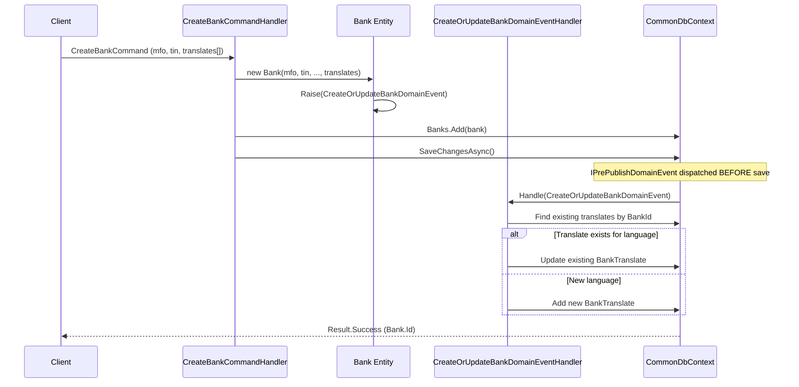
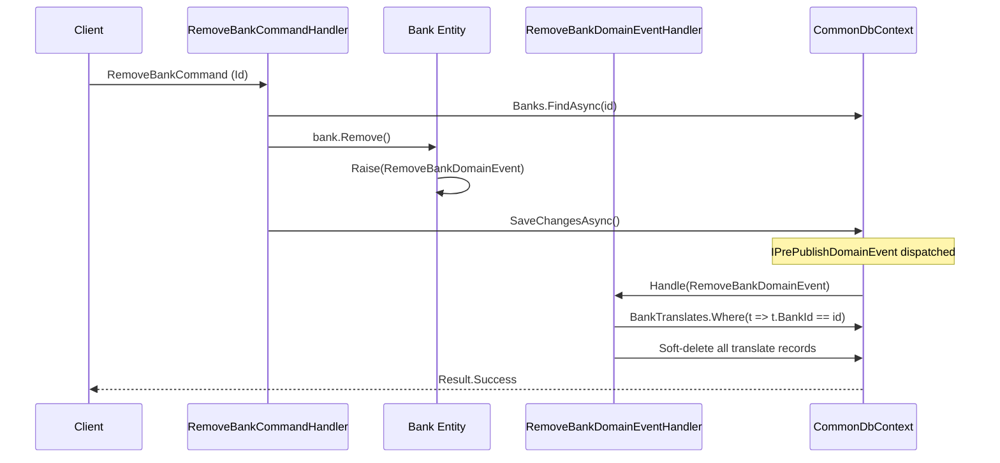
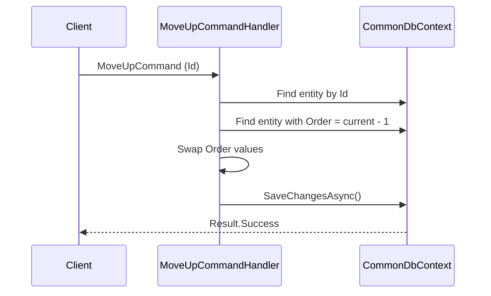
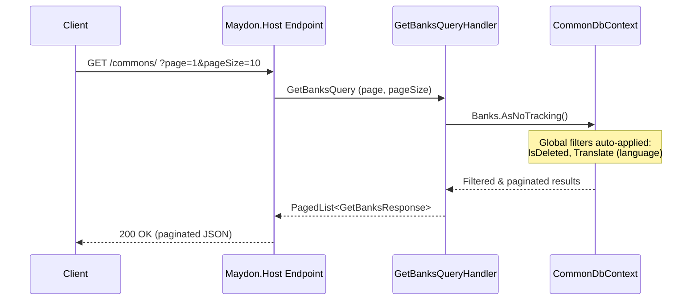

# Common Module — Flows

## Overview

The Common module exposes **read-only public endpoints** via `Maydon.Host`. All write operations (Create, Update, Remove, Reorder) exist as CQRS handlers in the Application layer but are **not exposed** through the Host API — they are consumed internally (e.g., admin panel, seeding, or direct handler invocation).

---

## Public API Endpoints

All endpoints are **anonymous** (`AllowAnonymous()`) and return **paginated** results.

| Method | Route              | Handler                          | Auth        | Response                          |
|--------|--------------------|----------------------------------|-------------|-----------------------------------|
| GET    | `/commons/`        | `GetBanksQueryHandler`           | Anonymous   | `PagedList<GetBanksResponse>`     |
| GET    | `/commons/`        | `GetCurrenciesQueryHandler`      | Anonymous   | `PagedList<GetCurrenciesResponse>`|
| GET    | `/commons/`        | `GetRegionsQueryHandler`         | Anonymous   | `PagedList<GetRegionsResponse>`   |
| GET    | `/commons/`        | `GetDistrictsQueryHandler`       | Anonymous   | `PagedList<GetDistrictsResponse>` |
| GET    | `/commons/`        | `GetLanguagesQueryHandler`       | Anonymous   | `PagedList<GetLanguagesResponse>` |

> [!NOTE]
> Each endpoint class sets `GroupName => AssemblyReference.Instance` (`"commons"`), so routes are prefixed with `/commons/`. The individual resource paths depend on the endpoint registration order and group nesting in `Maydon.Host`.

---

## CQRS Operations (Application Layer)

### Per Aggregate Operations

Each of the 4 translatable aggregates (Bank, Currency, Region, District) + Language supports:

| Operation     | Type      | Handler                          | Raises Event                     |
|---------------|-----------|----------------------------------|----------------------------------|
| **Create**    | Command   | `Create*CommandHandler`          | `CreateOrUpdate*DomainEvent`     |
| **Update**    | Command   | `Update*CommandHandler`          | `CreateOrUpdate*DomainEvent`     |
| **Remove**    | Command   | `Remove*CommandHandler`          | `Remove*DomainEvent`             |
| **Get**       | Query     | `Get*QueryHandler`               | —                                |
| **GetById**   | Query     | `GetById*QueryHandler`           | —                                |
| **MoveUp**    | Command   | `MoveUp*CommandHandler`          | —                                |
| **MoveDown**  | Command   | `MoveDown*CommandHandler`        | —                                |
| **SetOrder**  | Command   | `SetOrder*CommandHandler`        | —                                |

---

## Key Flows

### 1. Create Translatable Entity (Bank example)

### 2. Remove Entity with Translate Cleanup

### 3. Reorder (MoveUp/MoveDown)

### 4. Paginated Read (All Entities)

---

## Domain Event Side Effects

All domain events are `IPrePublishDomainEvent` — they are dispatched **before** `SaveChangesAsync` commits, ensuring translate records are part of the same transaction.

| Event                               | Handler                                   | Side Effect                            |
|-------------------------------------|-------------------------------------------|----------------------------------------|
| `CreateOrUpdateBankDomainEvent`     | `CreateOrUpdateBankDomainEventHandler`    | Upserts `BankTranslate` records        |
| `RemoveBankDomainEvent`             | `RemoveBankDomainEventHandler`            | Soft-deletes `BankTranslate` records   |
| `UpsertCurrencyDomainEvent`         | `UpsertCurrencyDomainEventHandler`        | Upserts `CurrencyTranslate` records    |
| `RemoveCurrencyDomainEvent`         | `RemoveCurrencyDomainEventHandler`        | Soft-deletes `CurrencyTranslate` records|
| `UpsertRegionDomainEvent`           | `UpsertRegionDomainEventHandler`          | Upserts `RegionTranslate` records      |
| `RemoveRegionDomainEvent`           | `RemoveRegionDomainEventHandler`          | Soft-deletes `RegionTranslate` records |
| `UpsertDistrictDomainEvent`         | `UpsertDistrictDomainEventHandler`        | Upserts `DistrictTranslate` records    |
| `RemoveDistrictDomainEvent`         | `RemoveDistrictDomainEventHandler`        | Soft-deletes `DistrictTranslate` records|
