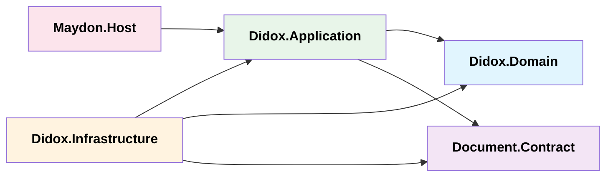
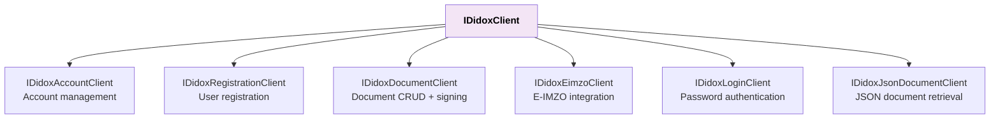

# Didox Module — Architecture

## Overview

The Didox module provides **integration with the Didox external e-signing and document management platform**. It manages Didox account credentials, authentication tokens, and serves as the bridge between the Document module's contract lifecycle and the Didox API for document signing, rejection, and status polling.

---

## Layered Architecture

```mermaid
graph TB
  subgraph "API Layer (Maydon.Host)"
    AE["DidoxAccountEndpoint<br/>/api/v1/didox-accounts"]
    AUE["DidoxAuthEndpoint<br/>/api/v1/didox-auth"]
    DDE["DidoxDocumentEndpoint<br/>/api/v1/didox-documents"]
  end

  subgraph "Didox.Application"
    ACC["Account Commands<br/>Create | Update | Delete"]
    ACQ["Account Queries<br/>GetById | GetList"]
    DOC["Document Queries<br/>GetHtml | GetPdf | GetJson"]
    AUTH["DidoxAuthService<br/>Token management + caching<br/>Registration flow"]
    PROV["DidoxDocumentProviderService<br/>Sign | Reject | GetStatus"]
  end

  subgraph "Didox.Application.Abstractions"
    ICLIENT["IDidoxClient<br/>Composite interface"]
    IDB["IDidoxDbContext"]
    ICLI_SUB["Sub-interfaces:<br/>IDidoxAccountClient<br/>IDidoxRegistrationClient<br/>IDidoxDocumentClient<br/>IDidoxEimzoClient<br/>IDidoxLoginClient<br/>IDidoxJsonDocumentClient"]
  end

  subgraph "Didox.Application.Contracts"
    DTO_ACC["Account DTOs<br/>Commands · Queries · Responses"]
    DTO_CLI["DidoxClient Contracts<br/>Factura · Act · CustomDocument<br/>MultiClient · Registration<br/>Auth · Common"]
  end

  subgraph "Didox.Domain"
    DA["DidoxAccount<br/>ISoftDeleteEntity"]
    DT["DidoxToken"]
  end

  subgraph "Didox.Infrastructure"
    DB["DidoxDbContext<br/>PostgreSQL · didox schema"]
    EC["Entity Configurations (2)"]
    CLI["DidoxClient<br/>HTTP client implementation"]
    WRK["DidoxExportWorker<br/>Idempotent event handler"]
    OPT["DidoxOptions<br/>Configuration"]
  end

  subgraph "External"
    DIDOX_API["Didox External API<br/>didox.uz"]
    DOC_MOD["Document Module<br/>Contract lifecycle"]
  end

  AE --> ACC & ACQ
  AUE --> AUTH
  DDE --> DOC
  ACC --> DA & IDB
  ACQ --> IDB
  DOC --> ICLIENT
  AUTH --> IDB & ICLIENT
  PROV --> ICLIENT & AUTH

  ACC -.->|uses| DTO_ACC
  DOC -.->|uses| DTO_CLI
  AUTH -.->|uses| DTO_CLI & DTO_ACC
  ICLIENT -.->|defines| ICLI_SUB

  CLI -->|implements| ICLIENT
  DB -->|implements| IDB
  DB --> EC
  DB --> DA & DT
  WRK -->|handles| DOC_MOD
  WRK --> ICLIENT & AUTH
  CLI -->|calls| DIDOX_API

  style DA fill:#e1f5fe,color:#000,font-weight:bold
  style DT fill:#e1f5fe,color:#000,font-weight:bold
  style DB fill:#fff3e0,color:#000,font-weight:bold
  style DIDOX_API fill:#fce4ec,color:#000,font-weight:bold
  style DOC_MOD fill:#e8f5e9,color:#000,font-weight:bold
```

---

## Project Dependencies

| Project | Role | Key Contents |
|---|---|---|
| **Didox.Domain** | Domain entities | `DidoxAccount` (ISoftDeleteEntity), `DidoxToken` |
| **Didox.Application** | CQRS handlers, services, contracts | 6 account command handlers, 2 query handlers, 3 document query handlers, `DidoxAuthService`, `DidoxDocumentProviderService`, 7 client abstraction interfaces, 58+ DTO contracts |
| **Didox.Infrastructure** | Persistence, HTTP client, worker | `DidoxDbContext`, `DidoxClient` (HTTP), `DidoxExportWorker` (integration event handler), 2 entity configurations |

---

## Core Services

### `DidoxAuthService` — Token Management

Handles authentication with the Didox external API. Background-safe (uses `IServiceScopeFactory`).

| Capability | Details |
|---|---|
| **Token caching** | FusionCache with 5-minute TTL, 10-second factory timeout, fail-safe enabled |
| **Token refresh** | Auto-refreshes expired tokens by re-authenticating with stored credentials |
| **Credential storage** | Passwords encrypted via `IStringEncryptor`, stored in `DidoxAccount` |
| **Registration** | Registers users in Didox, creates local `DidoxAccount` record |
| **Background safety** | Re-creates DI scopes internally to work outside HTTP context |

### `DidoxDocumentProviderService` — Document Operations

Implements `IDocumentProviderService` (defined in `Document.Contract`). Handles synchronous API calls only — status updates managed by the caller.

| Operation | Description |
|---|---|
| `SignDocumentAsync` | Signs a document in Didox via PKCS7 signature |
| `RejectDocumentAsync` | Rejects a document with optional reason |
| `GetDocumentStatusAsync` | Polls Didox for current document status, parses JSON response |

### `DidoxExportWorker` — Async Document Export

Handles `DocumentExportRequested` integration events. Uses idempotent base class to prevent duplicate exports.

| Step | Progress | Description |
|---|---|---|
| Authenticate | 10% | Obtains active token via `DidoxAuthService` |
| Validate | 30% | Verifies PDF content exists in payload |
| Upload | 60% | Builds `DocumentUploadRequest`, calls Didox API |
| Complete | 100% | Publishes `ProviderStatusChanged` event |

---

## IDidoxClient — Composite HTTP Interface

---

## Didox API Contract Types

The `Didox.Application.Contracts.DidoxClient` namespace contains 58+ DTO models for the Didox external API:

| Category | Models | Purpose |
|---|---|---|
| **Auth** | `LoginRequest`, `TokenResponse` | Password-based authentication |
| **Registration** | `RegistrationRequest` | Register new Didox users |
| **Account** | `AccountResponse`, `ChangeAccountRequest` | Manage Didox accounts |
| **Factura** | Request/Response hierarchy (15+ models) | E-invoice (faktura) operations |
| **Act** | Request/Response hierarchy (10+ models) | Empowerment act documents |
| **CustomDocument** | `DocumentUploadRequest`, `DocumentData`, `DocumentInfo` | Custom document upload (used for contracts) |
| **MultiClientDocument** | Multi-party document models | Documents with multiple clients |
| **Common** | `DidoxApiResponse<T>`, `DidoxDocType`, `Pkcs7SignatureRequest`, `ContractDoc` | Shared primitives and wrappers |

---

## DI Registration Summary

### Didox.Application (`AddDidoxApplication`)

- `IDidoxAuthService` → `DidoxAuthService` (scoped)
- `IDocumentProviderService` → `DidoxDocumentProviderService` (scoped)

### Didox.Infrastructure (`AddDidoxInfrastructure`)

- `DidoxDbContext` — pooled factory + scoped resolution
- `IDidoxDbContext` → `DidoxDbContext`
- `IIntegrationEventHandler<DocumentExportRequested>` → `DidoxExportWorker` (scoped)
- Module migration descriptor (order = 5, `HasSqlScripts = true`)

### Didox.Infrastructure.Client (`AddDidoxClient`)

- `IDidoxClient` → `DidoxClient` (HTTP client, configured via `DidoxOptions`)
