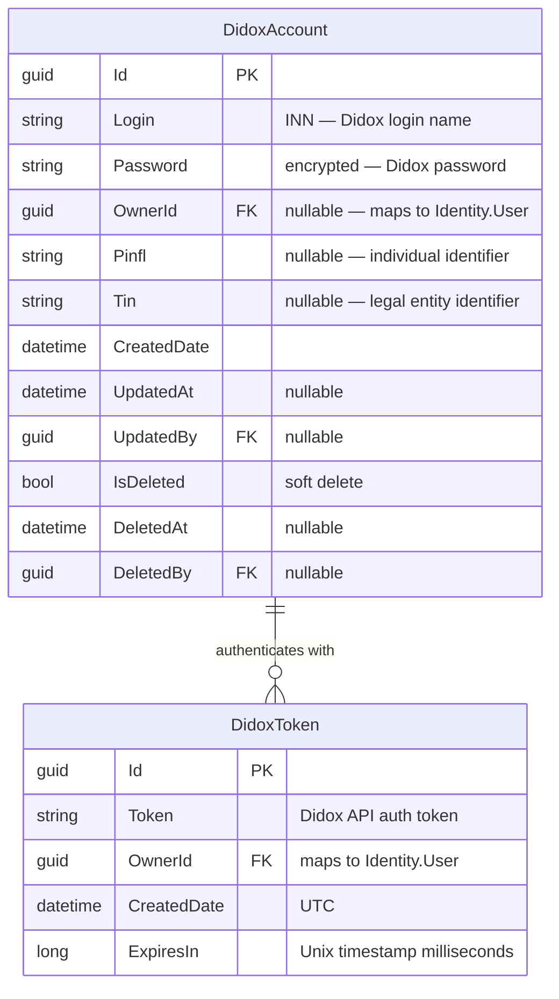
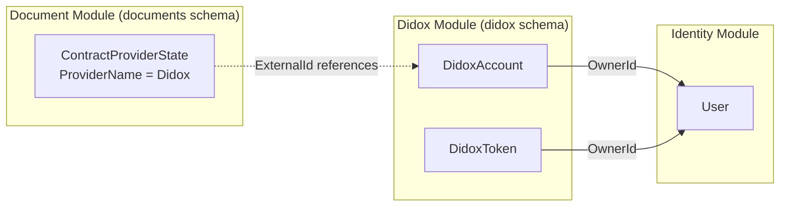

# Didox Module — Entity Relationship Diagram

## Overview

The Didox module manages **external Didox platform credentials and authentication tokens**. It operates in the `didox` PostgreSQL schema and is the 5th migration module in the system. The module has a minimal domain model — just two entities — since Didox documents and their status are tracked in the Document module's `ContractProviderState` entity.

---

## Entity Relationship Diagram

---

## Entity Details

### DidoxAccount

Represents a user's credentials for the Didox external platform.

| Property | Type | Constraints | Description |
|---|---|---|---|
| `Id` | `Guid` | PK | Unique identifier |
| `Login` | `string` | Required | Didox login (typically INN) |
| `Password` | `string` | Required | Encrypted Didox password |
| `OwnerId` | `Guid?` | FK → Identity.User | System user who owns this account |
| `Pinfl` | `string?` | — | Personal identification (PINFL) for individuals |
| `Tin` | `string?` | — | Tax identification number (INN) for legal entities |
| `CreatedDate` | `DateTime` | — | Account creation timestamp |
| `UpdatedAt` | `DateTime?` | — | Last update timestamp |
| `UpdatedBy` | `Guid?` | — | User who last updated |
| `IsDeleted` | `bool` | Default `false` | Soft delete flag |
| `DeletedAt` | `DateTime?` | — | Deletion timestamp |
| `DeletedBy` | `Guid?` | — | User who deleted |

**Implements:** `ISoftDeleteEntity` — participates in global query filter

### DidoxToken

Represents an active Didox API authentication token. One token per owner at a time — old tokens are removed before new ones are created.

| Property | Type | Constraints | Description |
|---|---|---|---|
| `Id` | `Guid` | PK | Unique identifier |
| `Token` | `string` | Required | Didox API bearer token |
| `OwnerId` | `Guid` | FK → Identity.User | Owner of this token |
| `CreatedDate` | `DateTime` | Default `UTC now` | Token creation timestamp |
| `ExpiresIn` | `long` | — | Expiration as Unix timestamp (ms) |

---

## Cross-Module Relationships

| Column | Source Entity | Target Module | Target Entity | Description |
|---|---|---|---|---|
| `OwnerId` | `DidoxAccount` | Identity | `User` | Which system user owns this Didox account |
| `OwnerId` | `DidoxToken` | Identity | `User` | Which system user this token belongs to |

> **Note:** The Document module's `ContractProviderState.ExternalId` stores the Didox document ID returned by the API. This is a string reference, not a foreign key.

---

## Database Details

| Property | Value |
|---|---|
| **Schema** | `didox` |
| **Naming Convention** | `snake_case` (EF Npgsql convention) |
| **Soft Delete** | `DidoxAccount` only (global query filter on `IsDeleted`) |
| **Migration Order** | 5 |
| **Has SQL Scripts** | Yes |
| **Migration History Table** | `__EFMigrationsHistory` in `didox` schema |
| **Connection String** | Shared (same PostgreSQL database as other modules) |
