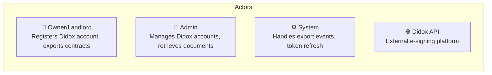
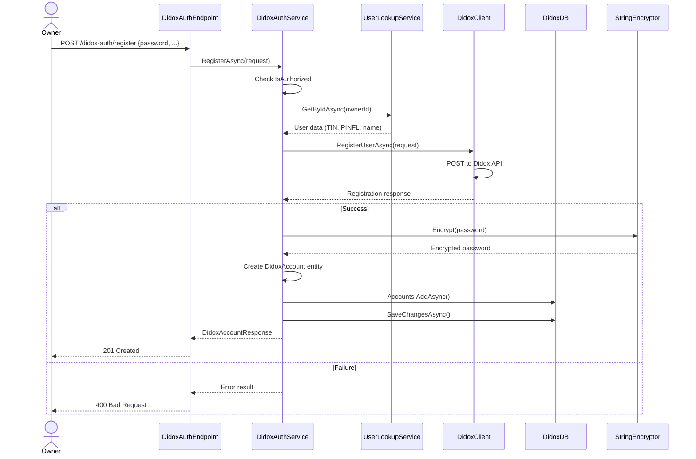
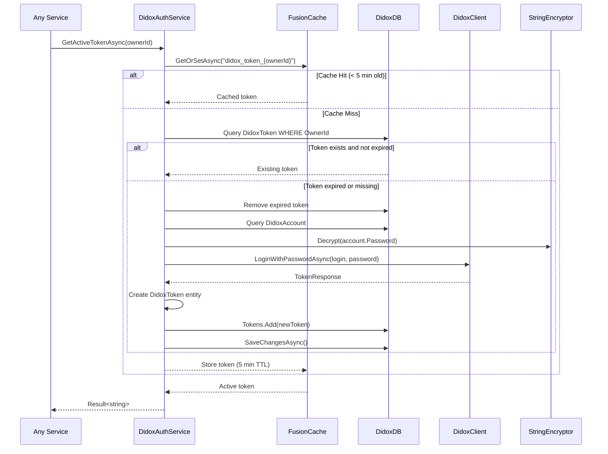
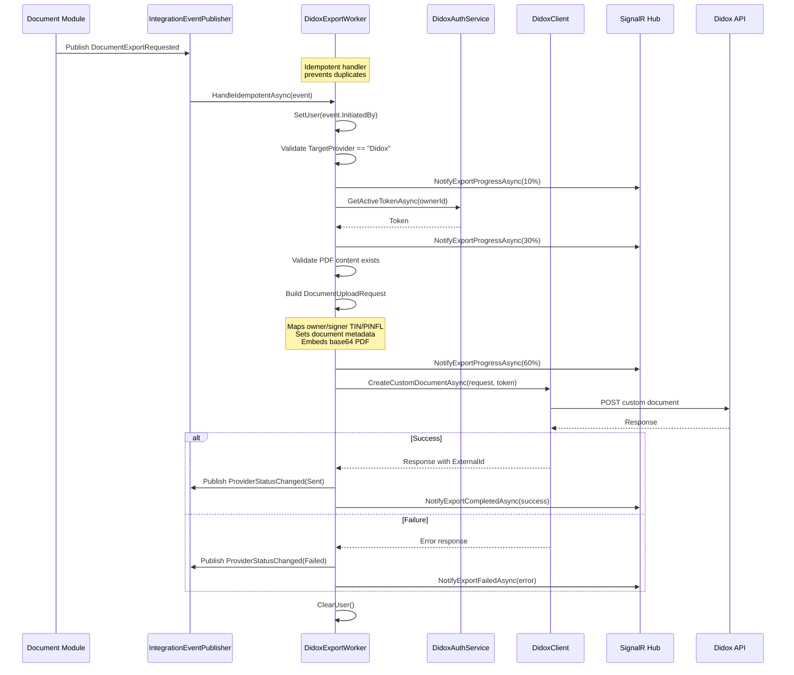
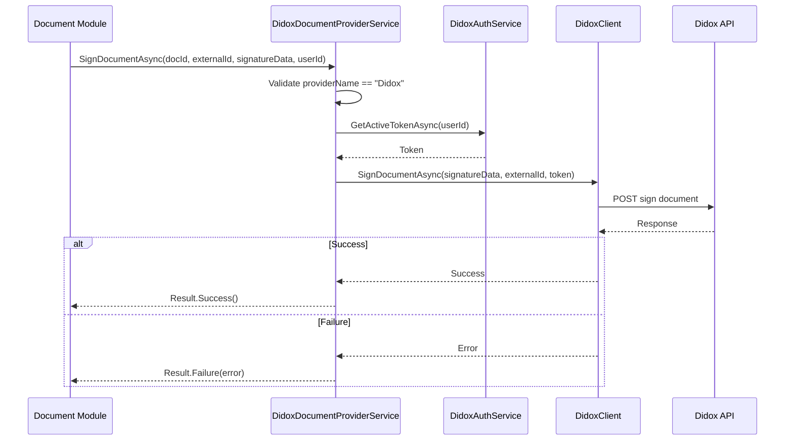
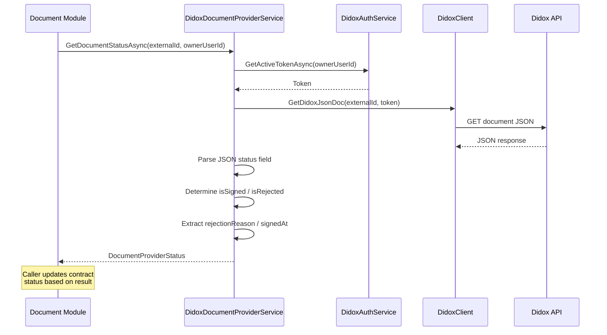
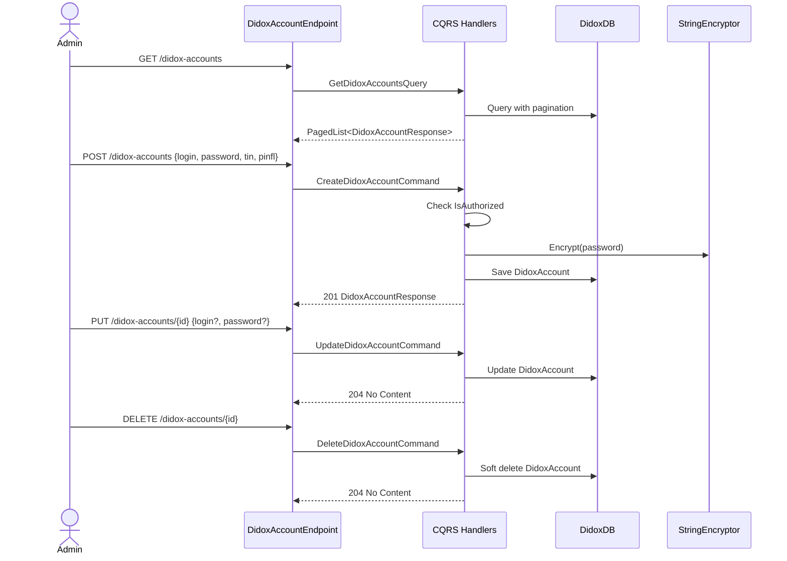

# Didox Module — Flows & Usage

## Actors

| Actor | Description | Key Actions |
|---|---|---|
| **Owner** | Property owner/landlord | Register in Didox, export contracts, sign/reject documents |
| **Admin** | System administrator | CRUD Didox accounts, retrieve documents in HTML/PDF/JSON |
| **System** | Background processes | Handle export events, refresh tokens, publish status changes |
| **Didox API** | External platform (didox.uz) | Accept documents, manage signatures, return document status |

---

## Flow 1: Didox Account Registration

---

## Flow 2: Token Acquisition & Caching

**Caching Strategy:**

| Parameter | Value |
|---|---|
| Cache key | `didox_token_{ownerId}` |
| Duration | 5 minutes |
| Factory timeout | 10 seconds |
| Fail-safe | Enabled (serves stale on refresh failure) |
| Token TTL in DB | 5 hours (Unix timestamp) |

---

## Flow 3: Document Export to Didox

---

## Flow 4: Document Signing via Didox

---

## Flow 5: Document Status Polling

**Status Parsing Logic:**

| JSON `status` field | `IsSigned` | `IsRejected` |
|---|---|---|
| Contains "signed" | `true` | `false` |
| Contains "rejected" or "cancelled" | `false` | `true` |
| Other | `false` | `false` |

---

## Flow 6: Account CRUD Operations

---

## API Endpoints Reference

### Didox Accounts (`/api/v1/didox-accounts`)

| Method | Path | Name | Description | Response |
|---|---|---|---|---|
| `GET` | `/` | GetDidoxAccounts | Paginated list of all Didox accounts | `PagedList<DidoxAccountResponse>` |
| `GET` | `/{id}` | GetDidoxAccountById | Get a specific Didox account | `DidoxAccountResponse` |
| `POST` | `/` | CreateDidoxAccount | Create a new Didox account | `201 DidoxAccountResponse` |
| `PUT` | `/{id}` | UpdateDidoxAccount | Update account credentials | `204` |
| `DELETE` | `/{id}` | DeleteDidoxAccount | Soft-delete a Didox account | `204` |

### Didox Auth (`/api/v1/didox-auth`)

| Method | Path | Name | Description | Response |
|---|---|---|---|---|
| `POST` | `/register` | DidoxRegistration | Register user in Didox + create local account | `201 DidoxAccountResponse` |

### Didox Documents (`/api/v1/didox-documents`)

| Method | Path | Name | Description | Response |
|---|---|---|---|---|
| `GET` | `/{id}/html` | GetDocumentHtml | Retrieve document as HTML | `text/html` |
| `GET` | `/{id}/pdf` | GetDocumentPdf | Retrieve document as PDF | `application/pdf` |
| `GET` | `/{id}/json` | GetDocumentJson | Retrieve raw document JSON | `application/json` |

---

## Integration Events

| Event | Direction | Handler | Purpose |
|---|---|---|---|
| `DocumentExportRequested` | Document → Didox | `DidoxExportWorker` | Upload contract PDF to Didox for signing |
| `ProviderStatusChanged` | Didox → Document | Document handlers | Report upload success/failure, status changes |

---

## Security Considerations

| Aspect | Implementation |
|---|---|
| **Password storage** | Encrypted via `IStringEncryptor` (not hashed — needs decryption for API calls) |
| **Token caching** | In-memory FusionCache, scoped per owner, 5-minute TTL |
| **Auth checks** | Manual `IsAuthorized` checks in service layer (not endpoint-level permissions) |
| **Idempotency** | `DidoxExportWorker` extends `IdempotentIntegrationEventHandlerBase` to prevent duplicate exports |
| **Background safety** | `DidoxAuthService` creates new DI scopes via `IServiceScopeFactory` for background operations |
