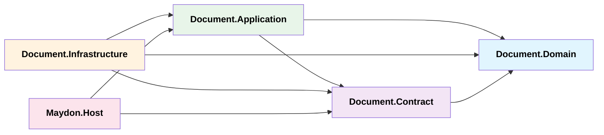
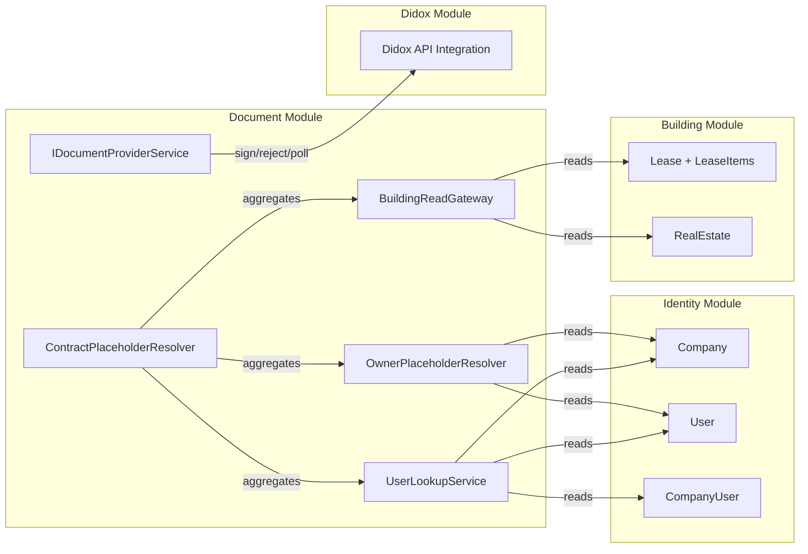
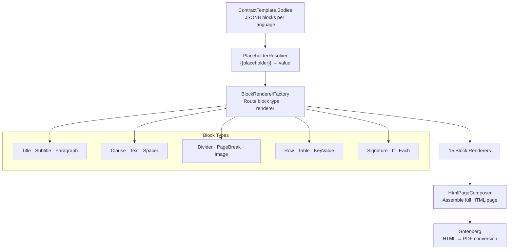

# Document Module — Architecture

## Layered Architecture

```mermaid
graph TB
  subgraph "API Layer"
    CE["ContractEndpoint<br/>/api/v1/documents/contracts"]
    CTE["ContractTemplateEndpoint<br/>/api/v1/documents/contract-templates"]
  end

  subgraph "Document.Application"
    CC["Contract Commands<br/>Create | UpdateBody | Regenerate<br/>Reject | ExportDidox | SyncDidox<br/>UploadAttachment"]
    CQ["Contract Queries<br/>GetById | List | Prefill<br/>GeneratePdf | ListAttachments"]
    TC["Template Commands<br/>Create | Update | UpdateBody<br/>Delete | Translations"]
    TQ["Template Queries<br/>GetById | GetList | Placeholders<br/>PreviewPdf | VersionHistory"]
    RE["Rendering Engine<br/>15 Block Renderers<br/>HtmlPageComposer<br/>PlaceholderResolver"]
    EX["ContractExportHandler<br/>InitiateDocumentExport → PDF"]
  end

  subgraph "Document.Contract (DTOs)"
    CMDS["Command Records"]
    QRS["Query Records"]
    RSP["Response Records"]
    GW["Gateway Interfaces"]
    IE["Integration Events"]
    SR["IDocumentStatusNotifier"]
  end

  subgraph "Document.Domain"
    C["Contract<br/>AggregateRoot"]
    CT["ContractTemplate<br/>AggregateRoot"]
    CFI["ContractFinancialItem"]
    CSE["ContractSigningEvent"]
    CA["ContractAttachment"]
    CPS["ContractProviderState<br/>ValueObject"]
    EVT["Domain Events (8)"]
  end

  subgraph "Document.Infrastructure"
    DB["DocumentDbContext<br/>PostgreSQL · documents schema"]
    EC["Entity Configurations (5)"]
    SVC["Services<br/>BuildingReadGateway<br/>ContractPlaceholderResolver<br/>OwnerPlaceholderResolver<br/>ContractNumberGenerator<br/>UserLookupService"]
    HUB["DocumentStatusHub<br/>DocumentStatusNotifier"]
    JOB["ExpireContractsJob<br/>Hourly background service"]
    VER["VersioningService<br/>VersionDiffService"]
  end

  subgraph "External Modules"
    BLD["Building Module<br/>Lease · RealEstate · LeaseItem"]
    IDN["Identity Module<br/>Company · User · CompanyUser"]
    DIDOX["Didox Module<br/>External e-signing integration"]
  end

  CE --> CC & CQ
  CTE --> TC & TQ
  CC --> C & GW
  CQ --> DB & GW
  TC --> CT
  TQ --> DB & RE
  EX --> RE & GW

  CC -.->|uses| CMDS & RSP
  CQ -.->|uses| QRS & RSP
  GW -.->|defines| SR & IE

  SVC -->|implements| GW
  HUB -->|implements| SR
  DB --> EC
  DB --> C & CT & CA

  SVC -->|reads| BLD
  SVC -->|reads| IDN
  EX -->|exports to| DIDOX
  JOB -->|expires| C

  style C fill:#e1f5fe,color:#000,font-weight:bold
  style CT fill:#e1f5fe,color:#000,font-weight:bold
  style DB fill:#fff3e0,color:#000,font-weight:bold
  style DIDOX fill:#fce4ec,color:#000,font-weight:bold
  style BLD fill:#e8f5e9,color:#000,font-weight:bold
  style IDN fill:#e8f5e9,color:#000,font-weight:bold
```

---

## Project Dependencies

| Project | Role | Key Contents |
|---|---|---|
| **Document.Domain** | Domain entities + events | `Contract`, `ContractTemplate`, 5 child entities, 8 domain events, 9 enums |
| **Document.Contract** | DTOs + interfaces (anti-corruption layer) | Commands, Queries, Responses, Gateway interfaces, Integration events, SignalR interface |
| **Document.Application** | CQRS handlers + rendering engine | 7 contract command handlers, 5 query handlers, 7 template command handlers, 5 template query handlers, block rendering pipeline |
| **Document.Infrastructure** | Persistence + external integrations | EF Core DbContext, 5 entity configs, 5 services, SignalR hub, background job, versioning |

---

## Cross-Module Gateways

The Document module communicates with other modules exclusively through **gateway interfaces** defined in `Document.Contract`, implemented in `Document.Infrastructure`.

| Gateway | Data Source | Purpose |
|---|---|---|
| `IBuildingReadGateway` | Building DB | Fetch `LeaseInfo` (lease terms + items) and `RealEstateInfo` (address, cadastral, area) |
| `IUserLookupService` | Identity DB | Lookup users by ID/TIN/PINFL, get company associations |
| `IOwnerPlaceholderResolver` | Identity DB | Resolve owner company placeholders (name, INN, address, bank details) |
| `IContractPlaceholderResolver` | All sources | Aggregate all placeholder values for contract generation |
| `IDocumentProviderService` | Didox Module | Sign, reject, and poll document status via Didox integration |
| `IContractNumberGenerator` | Document DB | Generate unique sequential contract numbers per tenant |

---

## Rendering Engine

The template rendering pipeline converts JSONB block definitions to HTML for PDF generation.

| Component | File | Purpose |
|---|---|---|
| `PlaceholderRegistry` | Rendering/ | Registry of all known placeholders with categories and descriptions |
| `PlaceholderResolver` | Rendering/ | Substitutes `{{placeholder}}` tokens in block content |
| `BlockRendererFactory` | Rendering/ | Routes block `type` string to the correct `IBlockRenderer` |
| `BlockValidator` | Rendering/ | Validates JSONB block structure before rendering |
| `HtmlPageComposer` | Rendering/ | Composes full HTML document with page/theme/header/footer |
| `IBlockRenderer` (×15) | Rendering/Renderers/ | Each renderer converts one block type to HTML fragment |

---

## Infrastructure Components

### Background Job: `ExpireContractsJob`

- **Schedule:** Runs every **1 hour** via `BackgroundService`
- **Targets:** Contracts with `OwnerSigned` or `PendingSignature` status whose `SignatureDeadline < now()`
- **Action:** Calls `contract.MarkExpired()` → sets status to `ExpiredUnsigned`, updates Didox provider state to `Expired`

### SignalR: Real-Time Notifications

- **Hub:** `DocumentStatusHub` — connected by frontend clients
- **Service:** `DocumentStatusNotifier` — sends notifications for:
  - Status changes (`Draft → Sent → Signed`)
  - Export progress (percentage)
  - Export completion/failure

### Versioning

- **`IVersioningService`** — Stores contract body snapshots per version
- **`IVersionDiffService`** — Computes diffs between versions

---

## DI Registration Summary

### Document.Application (`AddDocumentApplication`)

- 15 × `IBlockRenderer` singleton instances
- 1 × `BlockRendererFactory` singleton
- 1 × `ContractExportHandler` scoped (handles `InitiateDocumentExport`)

### Document.Infrastructure (`AddDocumentInfrastructure`)

- `DocumentDbContext` — pooled factory + scoped resolution
- `IDocumentStatusNotifier` → `DocumentStatusNotifier`
- `IUserLookupService` → `UserLookupService`
- `IOwnerPlaceholderResolver` → `OwnerPlaceholderResolver`
- `IBuildingReadGateway` → `BuildingReadGateway`
- `IContractPlaceholderResolver` → `ContractPlaceholderResolver`
- `IContractNumberGenerator` → `ContractNumberGenerator`
- `IVersioningService` → `VersioningService`
- `IVersionDiffService` → `VersionDiffService`
- `ExpireContractsJob` — hosted background service
- Module migration descriptor (order = 4)
