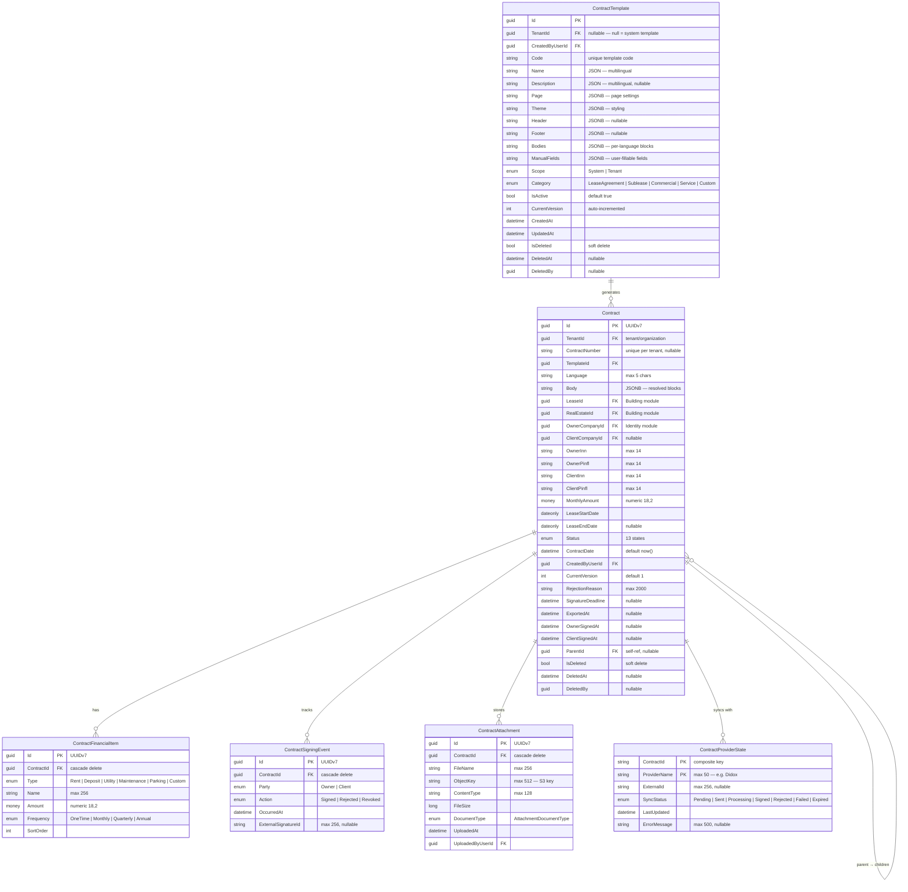
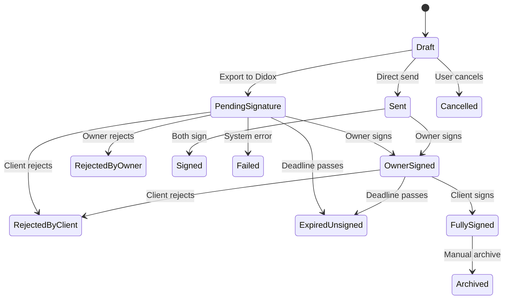

# Document Module — Entity Relationship Diagram

## Overview

The Document module manages **contract lifecycle** — from template-based generation through digital signing via Didox. It operates in the `documents` PostgreSQL schema and is the 4th migration module in the system.

---

## Entity Relationship Diagram

---

## Enums Reference

### ContractStatus (13 states)

| Value | Int | Description |
|---|---|---|
| `Draft` | 0 | Initial state, editable |
| `PendingSignature` | 1 | Exported, awaiting signatures |
| `Sent` | 2 | Sent to external provider |
| `Signed` | 3 | Legacy — single-step signed |
| `Rejected` | 4 | Legacy — single-step rejected |
| `Archived` | 5 | Final archive state |
| `Failed` | 6 | System/export failure |
| `Cancelled` | 7 | User-cancelled |
| `OwnerSigned` | 8 | Owner signed, awaiting client |
| `FullySigned` | 9 | Both parties signed |
| `RejectedByOwner` | 10 | Owner rejected |
| `RejectedByClient` | 11 | Client rejected |
| `ExpiredUnsigned` | 12 | Deadline passed unsigned |

### Other Enums

| Enum | Values |
|---|---|
| `FinancialItemType` | Rent, Deposit, Utility, Maintenance, Parking, Custom |
| `FinancialFrequency` | OneTime, Monthly, Quarterly, Annual |
| `SigningParty` | Owner, Client |
| `SigningAction` | Signed, Rejected, Revoked |
| `ContractTemplateScope` | System (0), Tenant (1) |
| `ContractTemplateCategory` | LeaseAgreement, Sublease, Commercial, Service, Custom(99) |
| `ExternalSyncStatus` | Pending, Sent, Processing, Signed, Rejected, Failed, Expired |
| `DidoxDocumentStatus` | Draft, AwaitingPartnerSignature, AwaitingYourSignature, Signed, SignatureDeclined, Deleted, +11 more |
| `AttachmentDocumentType` | *(defined in Contract project)* |

---

## Database Details

| Property | Value |
|---|---|
| **Schema** | `documents` |
| **Naming Convention** | `snake_case` (EF  Npgsql convention) |
| **Money Columns** | `numeric(18,2)` via `MoneyToDecimalConverter` |
| **Status Storage** | String conversion (not integer) |
| **Soft Delete** | Global query filter on `IsDeleted` |
| **Migration Order** | 4 |

### Indexes

| Table | Index | Type |
|---|---|---|
| `contracts` | `tenant_id` | Regular |
| `contracts` | `lease_id` | Regular |
| `contracts` | `template_id` | Regular |
| `contracts` | `status` | Regular |
| `contracts` | `parent_id` | Regular |
| `contracts` | `created_by_user_id` | Regular |
| `contracts` | `(tenant_id, contract_number)` | Unique partial (`WHERE contract_number IS NOT NULL`) |

### Cross-Module Foreign Keys (Logical)

| Contract Column | Target Module | Target Entity |
|---|---|---|
| `LeaseId` | Building | `Lease` |
| `RealEstateId` | Building | `RealEstate` |
| `OwnerCompanyId` | Identity | `Company` |
| `ClientCompanyId` | Identity | `Company` |
| `CreatedByUserId` | Identity | `User` |
| `TenantId` | Identity | `Tenant/Organization` |
