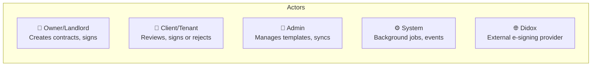
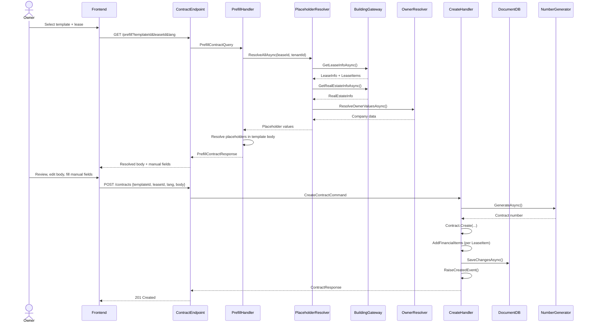
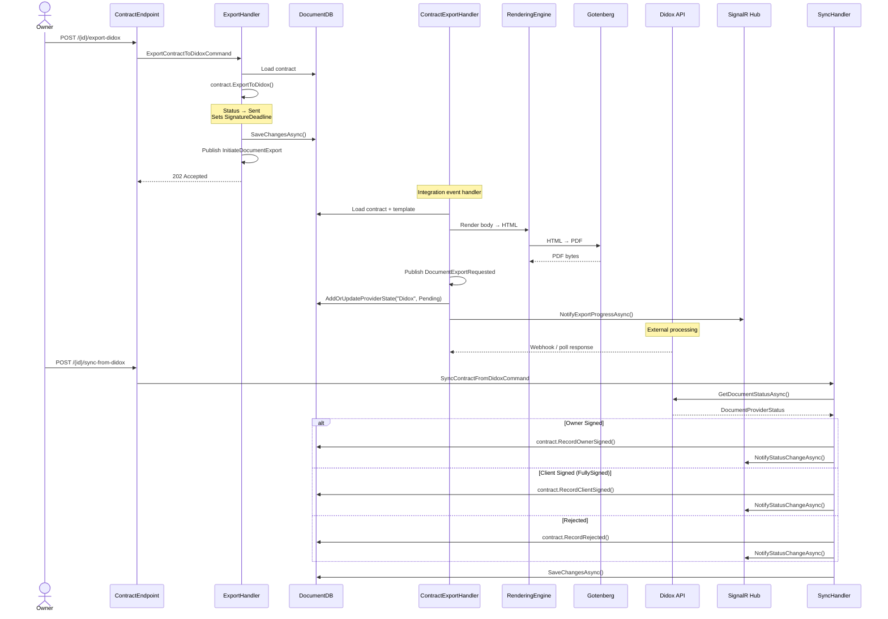
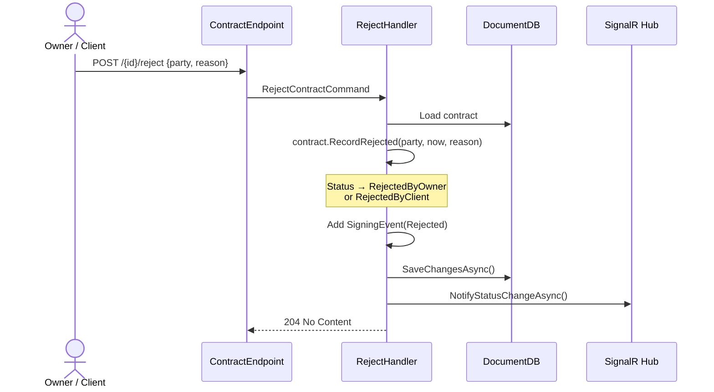
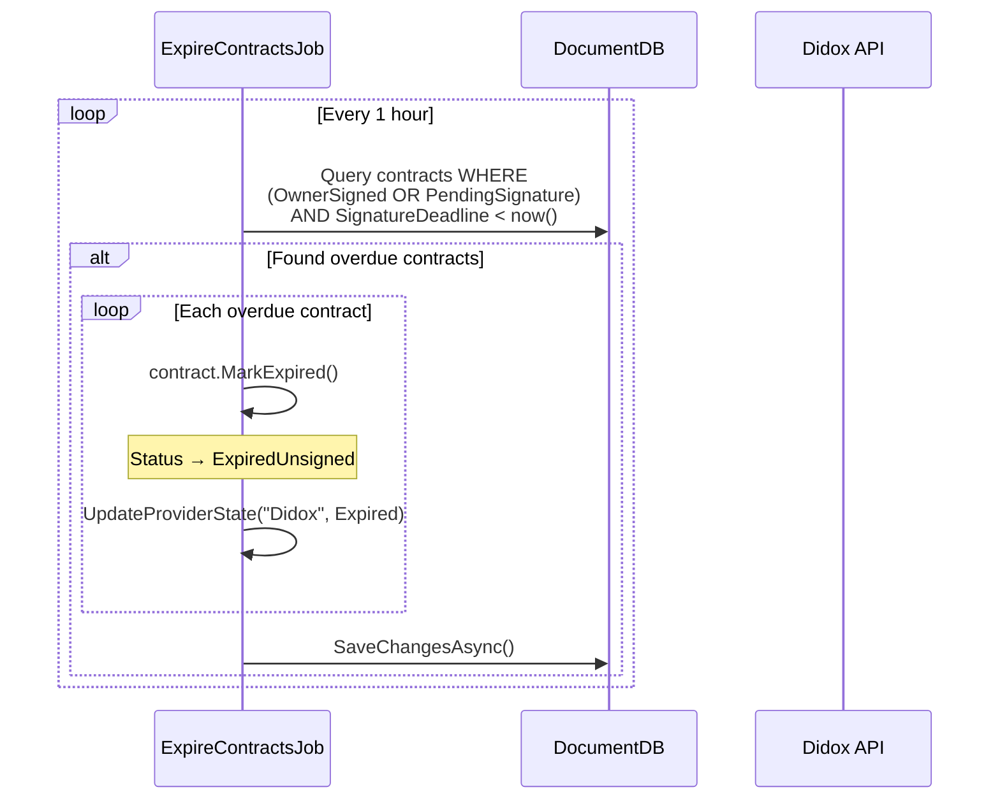
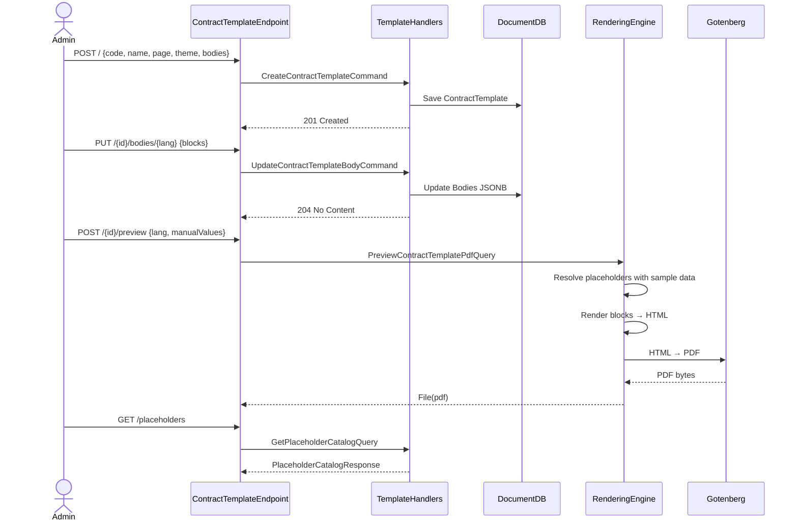
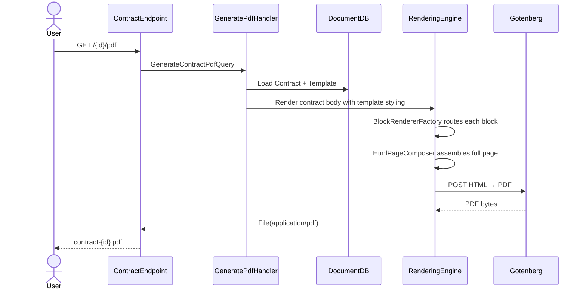

# Document Module — Flows & Usage

## Actors

| Actor | Description | Key Actions |
|---|---|---|
| **Owner** | Property owner/landlord user | Create contracts, edit body, export to Didox, sign, upload attachments |
| **Client** | Tenant/lessee user | Review contract, sign or reject |
| **Admin** | System administrator | Manage templates, sync from Didox, view all contracts |
| **System** | Background processes | Expire unsigned contracts, process integration events |
| **Didox** | External e-signing API | Receive documents, track signatures, send status callbacks |

---

## Flow 1: Contract Creation (Happy Path)

---

## Flow 2: Didox Export & Signing

---

## Flow 3: Contract Rejection

---

## Flow 4: Contract Expiration (Background Job)

---

## Flow 5: Template Management

---

## Flow 6: PDF Generation

---

## Actor-Action Matrix

| Action | Owner | Client | Admin | System |
|---|:---:|:---:|:---:|:---:|
| **Create contract** | ✅ | ❌ | ✅ | ❌ |
| **Edit contract body** | ✅ (Draft) | ❌ | ✅ (Draft) | ❌ |
| **Regenerate contract** | ✅ (Draft) | ❌ | ✅ (Draft) | ❌ |
| **Export to Didox** | ✅ | ❌ | ✅ | ❌ |
| **Sign contract** | ✅ (via Didox) | ✅ (via Didox) | ❌ | ❌ |
| **Reject contract** | ✅ | ✅ | ❌ | ❌ |
| **Sync from Didox** | ❌ | ❌ | ✅ | ❌ |
| **Upload attachment** | ✅ | ❌ | ✅ | ❌ |
| **Download PDF** | ✅ | ✅ | ✅ | ❌ |
| **List contracts** | ✅ (own) | ✅ (own) | ✅ (all) | ❌ |
| **Create template** | ❌ | ❌ | ✅ | ❌ |
| **Update template** | ❌ | ❌ | ✅ | ❌ |
| **Delete template** | ❌ | ❌ | ✅ | ❌ |
| **Preview template PDF** | ❌ | ❌ | ✅ | ❌ |
| **Expire contracts** | ❌ | ❌ | ❌ | ✅ (hourly) |
| **Send SignalR notifications** | ❌ | ❌ | ❌ | ✅ |

---

## API Endpoints Reference

### Contracts (`/api/v1/documents/contracts`)

| Method | Path | Name | Description | Response |
|---|---|---|---|---|
| `GET` | `/{id}` | GetContractById | Get contract details | `ContractResponse` |
| `POST` | `/` | CreateContract | Create draft contract | `201 ContractResponse` |
| `PUT` | `/{id}/body` | UpdateContractBody | Edit JSONB body (Draft only) | `204` |
| `PUT` | `/{id}/regenerate` | RegenerateContract | Regenerate + bump version | `204` |
| `POST` | `/{id}/export-didox` | ExportContractToDidox | Export for signing | `202` |
| `POST` | `/{id}/reject` | RejectContract | Reject by party | `204` |
| `POST` | `/{id}/sync-from-didox` | SyncContractFromDidox | Poll Didox status | `204` |
| `GET` | `/{id}/pdf` | GetContractPdf | Download PDF | `application/pdf` |
| `POST` | `/{id}/attachments` | UploadContractAttachment | Upload file (≤10MB) | `201` |
| `GET` | `/{id}/attachments` | ListContractAttachments | List attachment metadata | `ContractAttachmentResponse[]` |
| `GET` | `/` | ListContracts | Paginated list with filters | `PagedContractResponse` |
| `GET` | `/prefill` | PrefillContract | Pre-fill template with data | `PrefillContractResponse` |

### Contract Templates (`/api/v1/documents/contract-templates`)

| Method | Path | Name | Description | Response |
|---|---|---|---|---|
| `GET` | `/` | GetContractTemplates | Paginated + filtered list | `PagedList<ListResponse>` |
| `GET` | `/{id}` | GetContractTemplateById | Full template with bodies | `ContractTemplateResponse` |
| `POST` | `/` | CreateContractTemplate | Create new template | `201 ContractTemplateResponse` |
| `PUT` | `/{id}` | UpdateContractTemplate | Update metadata + bump version | `204` |
| `PUT` | `/{id}/bodies/{lang}` | UpdateContractTemplateBody | Update single language body | `204` |
| `DELETE` | `/{id}` | DeleteContractTemplate | Soft-delete | `204` |
| `POST` | `/{id}/preview` | PreviewContractTemplatePdf | Generate PDF preview | `application/pdf` |
| `GET` | `/placeholders` | GetPlaceholderCatalog | Available placeholder catalog | `PlaceholderCatalogResponse` |

---

## Domain Events

| Event | When | Payload |
|---|---|---|
| `ContractCreatedDomainEvent` | Contract created | ContractId, TenantId, TemplateId, LeaseId |
| `ContractBodyUpdatedDomainEvent` | Body edited | ContractId |
| `ContractRegeneratedDomainEvent` | Body regenerated | ContractId, NewVersion |
| `ContractStatusChangedDomainEvent` | Status transition | ContractId, OldStatus, NewStatus |
| `ContractExportedToDidoxDomainEvent` | Exported to Didox | ContractId |
| `ContractExpiredDomainEvent` | Deadline passed | ContractId |
| `ContractOwnerSignedDomainEvent` | Owner signed | ContractId, SignedAt |
| `ContractClientSignedDomainEvent` | Client signed | ContractId, SignedAt |
| `ContractRejectedDomainEvent` | Party rejected | ContractId, Party, Reason |

## Integration Events

| Event | Direction | Purpose |
|---|---|---|
| `InitiateDocumentExport` | Internal → Export handler | Triggers PDF generation + Didox upload |
| `DocumentExportRequested` | Export handler → Didox worker | Carries PDF payload for external send |
| `ProviderStatusChanged` | Didox → Internal | Provider status update (sign/reject/fail) |
