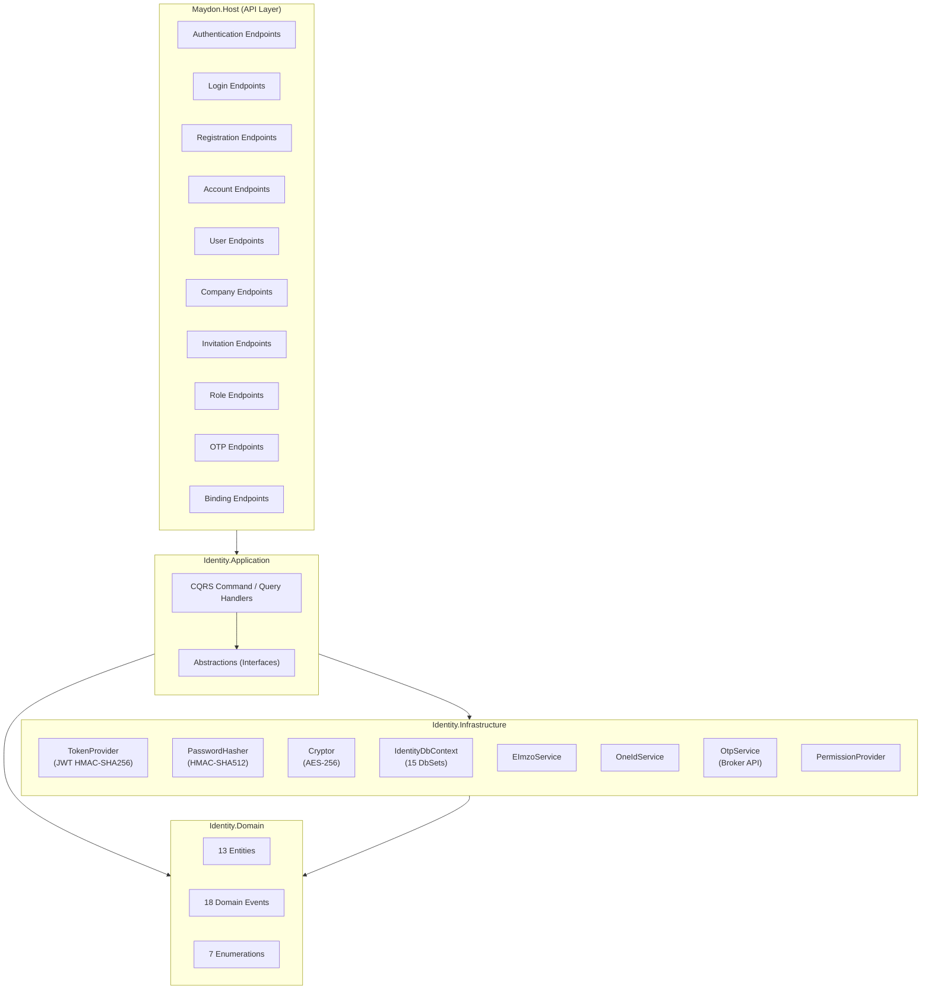
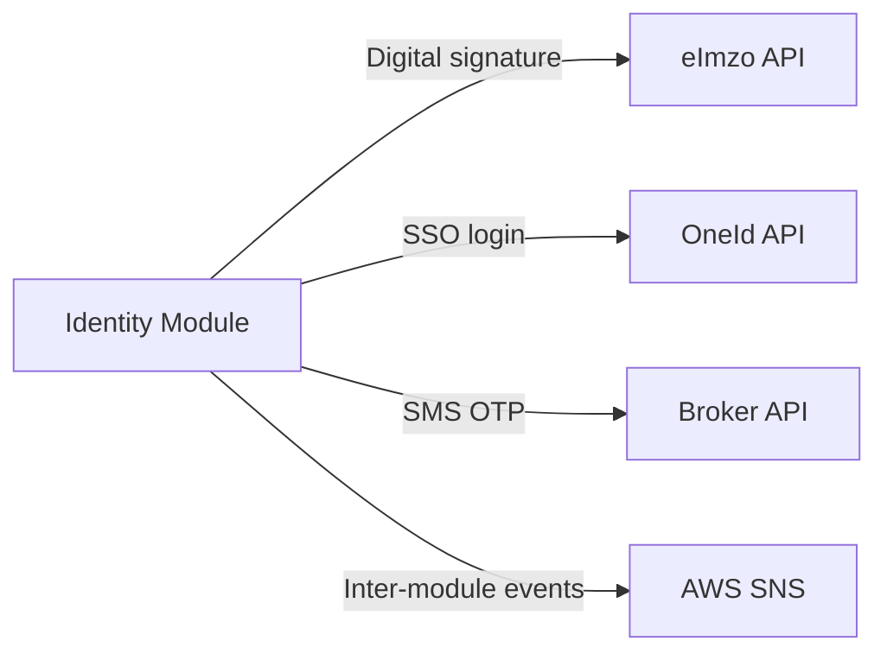

# Identity Module — Architecture

## Overview

The Identity module handles **user registration, authentication (JWT), account management, multi-tenancy, role-based access control (RBAC), company management, invitations, OTPs, and bank property management**. It follows a strict layered architecture: **Domain → Application → Infrastructure**, exposed via API endpoints in `Maydon.Host`.

---

## Module Structure

```
Identity/
├── Identity.Domain/            ← Entities, enums, domain events
│   ├── Accounts/               ← Account entity + AccountType enum + events
│   ├── BankProperties/         ← BankProperty entity + events
│   ├── Companies/              ← Company entity + events
│   ├── CompanyUsers/           ← CompanyUser join entity + events
│   ├── IntegrationServices/    ← IntegrationService entity + enum
│   ├── Invitations/            ← Invitation entity + InvitationStatus + events
│   ├── OtpContents/            ← OtpContent entity (localized SMS templates)
│   ├── Otps/                   ← Otp entity + OtpStatus + OtpType
│   ├── RolePermissions/        ← RolePermission join entity
│   ├── Roles/                  ← Role entity + events
│   ├── Sessions/               ← Session entity (refresh tokens)
│   ├── UserStates/             ← UserState entity (registration flow state)
│   └── Users/                  ← User entity + RegisterType + UserAccount record
│
├── Identity.Application/       ← CQRS handlers, abstractions, validators
│   ├── Accounts/               ← Account CRUD (23 files)
│   ├── Authentication/         ← Registration, Login, Logout, RefreshToken, ForgotPassword (48 files)
│   ├── BankProperties/         ← Bank property CRUD (16 files)
│   ├── Bindings/               ← eImzo/OneId binding (6 files)
│   ├── Companies/              ← Company CRUD (13 files)
│   ├── CompanyUsers/           ← Company-User management (11 files)
│   ├── Files/                  ← File/logo upload (13 files)
│   ├── Invitations/            ← Invitation lifecycle (29 files)
│   ├── OtpContents/            ← OTP template management (9 files)
│   ├── Otps/                   ← OTP lifecycle (9 files)
│   ├── Roles/                  ← Role CRUD + permissions (21 files)
│   ├── Users/                  ← User CRUD + profile + permissions (29 files)
│   └── Core/                   ← Shared abstractions
│       ├── Abstractions/
│       │   ├── Authentication/  ← IPasswordHasher, ITokenProvider
│       │   ├── Cryptors/        ← ICryptor
│       │   ├── Data/            ← IIdentityDbContext
│       │   └── Services/        ← IEImzoService (7), IOneIdService (4), IOtpService (1)
│       ├── Options/             ← ApplicationOptions
│       ├── Resources/           ← Localization resources
│       └── Validators/          ← Shared validators
│
├── Identity.Infrastructure/    ← Implementations
│   ├── Authentication/         ← TokenProvider, PasswordHasher
│   ├── Authorization/          ← IdentityPermissionProvider
│   ├── Cryptors/               ← Cryptor (AES-256 column encryption)
│   ├── Database/
│   │   ├── IdentityDbContext.cs ← 15 DbSets, compiled queries, global query filters
│   │   ├── Configurations/      ← 14 EF Core entity configurations
│   │   └── Seeds/               ← Data seeds
│   ├── Extensions/             ← DI extension methods
│   │   ├── AuthenticationExtensions.cs
│   │   ├── AuthorizationExtensions.cs
│   │   ├── DatabaseExtensions.cs
│   │   ├── HttpClientExtensions.cs
│   │   └── OptionsExtensions.cs
│   ├── Migrations/             ← EF Core migrations
│   ├── Options/                ← EImzoOptions, OneIdOptions, OtpOptions
│   └── Services/               ← External service clients
│       ├── EImzo/               ← EImzoService
│       ├── OneId/               ← OneIdService
│       └── Otp/                 ← OtpService (Broker API HTTP client)
```

---

## Layered Architecture



---

## Dependency Injection

### Application Layer (`AddIdentityApplication`)

```csharp
services.AddOptions<ApplicationOptions>()
    .BindConfiguration(nameof(ApplicationOptions))
    .ValidateDataAnnotations()
    .ValidateOnStart();
```

> **Note:** Handler registration is currently done via conventions in Core, the commented-out Scrutor scanning code is not active.

### Infrastructure Layer (`AddIdentityInfrastructure`)

Delegates to 5 extension methods:

| Extension | Registers |
|---|---|
| `AddOptionsInternal()` | `EImzoOptions`, `OneIdOptions`, `OtpOptions` |
| `AddHttpClients()` | Typed HTTP clients for eImzo, OneId |
| `AddAuthenticationInternal()` | `ITokenProvider` → `TokenProvider`, `IPasswordHasher` → `PasswordHasher` |
| `AddAuthorizationInternal()` | `IPermissionProvider` → `IdentityPermissionProvider` |
| `AddDatabase()` | `IdentityDbContext` (pooled), `IIdentityDbContext`, module migrator (order 1) |

---

## Authentication & Token System

### JWT Token Structure

| Claim | Source | Key Constant |
|---|---|---|
| `account_id` | `Account.Id` | `IExecutionContextProvider.AccountIdKey` |
| `session_id` | `Session.Id` | `IExecutionContextProvider.SessionIdKey` |
| `tenant_id` | `Account.TenantId` | `IExecutionContextProvider.TenantIdKey` |
| `user_id` | `Account.UserId` | `IExecutionContextProvider.UserIdKey` |
| `role_id` | `Account.RoleId` | `IExecutionContextProvider.RoleIdKey` |
| `is_owner` | `RoleType == Owner` | `IExecutionContextProvider.IsOwnerKey` |
| `account_type` | `Account.Type` (int) | `IExecutionContextProvider.AccountTypeKey` |
| `is_individual` | `TenantId == UserId` | `IExecutionContextProvider.IsIndividualKey` |

**Algorithm:** HMAC-SHA256  
**Refresh Token:** 64 random bytes → Base64 (stored encrypted in `Session.RefreshToken`)

### Password Hashing

- **Algorithm:** HMAC-SHA512
- **Salt:** Auto-generated 128-byte HMAC key
- **Hash output:** 64 bytes
- **Verification:** Constant-time `SequenceEqual`

---

## Multi-Tenancy & Query Filters

`IdentityDbContext.SetGlobalQuery<T>` applies stacked global query filters:

| Filter | Applied To | Logic |
|---|---|---|
| `IsDeleted` | **All entities** | `!item.IsDeleted` |
| `IsActive` | Account, Company, CompanyUser, Permission, Role, User, UserState | `item.IsActive == true` |
| `TenantId` | Account → `UserId == currentUser`; Invitation → `SenderId == tenant OR RecipientId == user`; CompanyUser → `CompanyId == tenant`; Role → `TenantId == tenant OR TenantId == null` |
| `Instance` | Permission | `Instance == "identity"` |
| `Translate` | PermissionTranslate | `LanguageShortCode == currentLanguage` |

---

## External Service Integrations



| Service | Interface | Purpose | Configuration |
|---|---|---|---|
| **eImzo** | `IEImzoService` (7 operations) | Digital signature auth, challenge/response, mobile auth | `EImzoOptions` (URL, ApiKey) |
| **OneId** | `IOneIdService` (4 operations) | SSO login, user info retrieval | `OneIdOptions` (ClientId, Secret, RedirectUri) |
| **Broker API** | `IOtpService` | SMS delivery for OTPs via HTTP (`/broker-api/send`) | `OtpOptions` (Uri, ClientId, Secret, localized content) |
| **AWS SNS** | `IAmazonSNSService` (from Core) | Inter-module event propagation (role/company/user sync) | Core configuration |

---

## Registration Methods

| Method | Registration Handler | Login Handler | Key |
|---|---|---|---|
| **Phone Number** | `PhoneNumberRegistrationCommandHandler` → OTP flow | `PhoneNumberLoginCommandHandler` | Password |
| **Phone + Confirm** | `PhoneNumberRegistrationConfirmCommandHandler` | — | OTP code |
| **eImzo (USB)** | `EImzoRegistrationCommandHandler` | `EImzoLoginCommandHandler` | PKCS#7 signature |
| **eImzo (Mobile)** | `EImzoMobileRegistrationCommandHandler` | `EImzoMobileLoginCommandHandler` | Mobile challenge |
| **OneId** | `OneIdRegistrationCommandHandler` | `OneIdLoginCommandHandler` | OAuth code |

All registration/login handlers extend `BaseAuthenticationCommandHandler` which orchestrates:

1. User lookup or creation
2. Company creation (if owner flow)
3. Account + Role assignment
4. Session creation
5. JWT + Refresh token generation

---

## Security Summary

| Aspect | Implementation |
|---|---|
| **Authentication** | JWT Bearer (HMAC-SHA256, configurable via `JwtOptions`) |
| **Password storage** | HMAC-SHA512 with per-user 128-byte salt |
| **Sensitive data** | AES-256 column-level encryption (`[EncryptColumn]`) |
| **Session management** | Refresh tokens with expiry, termination support |
| **OTP protection** | Rate limiting (3 sends/OTP), brute-force protection (4 tries, 30-min block) |
| **Multi-tenancy** | Global query filters on `TenantId` |
| **Authorization** | RBAC via `RolePermission` → `.HasPermission()` in endpoints |
