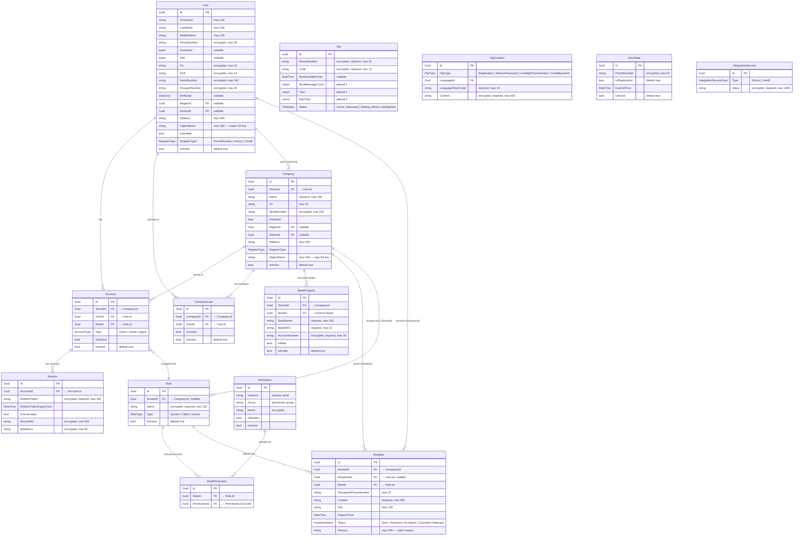
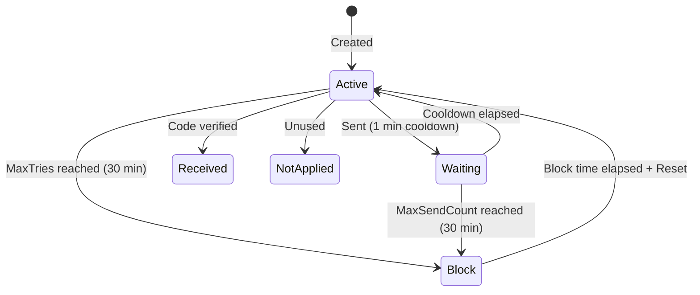
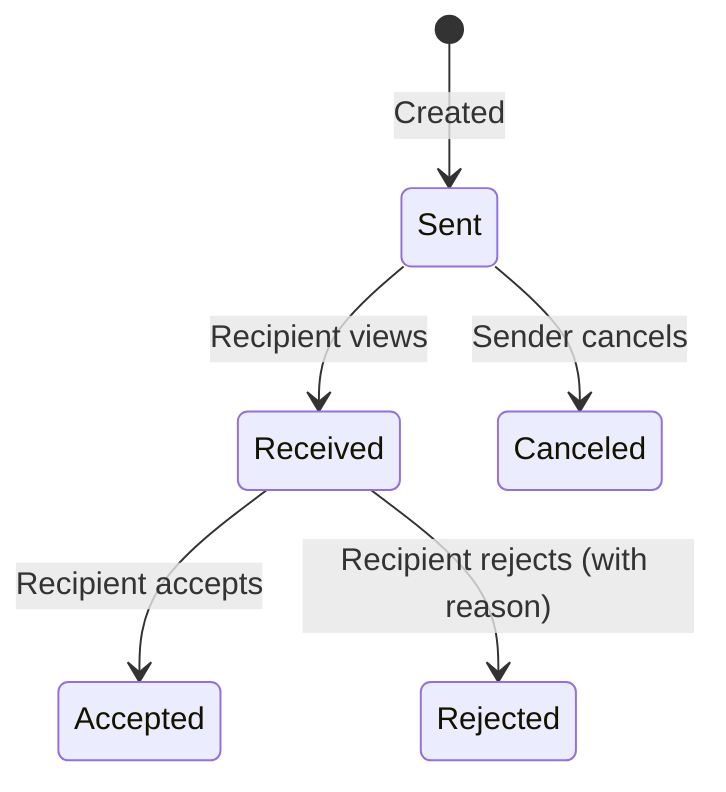

# Identity Module — Entity Relationship Diagram

## Overview

The Identity module manages **user accounts, companies, roles, permissions, sessions, invitations, OTPs, and bank properties**. It operates in the `identity` PostgreSQL schema. All entities inherit from a shared `Entity` base class providing `Id`, `CreatedBy`, `UpdatedBy`, `CreatedAt`, `UpdatedAt`, `DeletedAt`, `IsDeleted`.

---

## Entity Relationship Diagram

---

## Enums Reference

| Enum | Values |
|---|---|
| `RegisterType` | `PhoneNumber = 0`, `EImzo`, `OneID` |
| `AccountType` | `Client = 0`, `Owner`, `Agent` |
| `RoleType` | `System = 0`, `Client`, `Owner` (flags) |
| `InvitationStatus` | `Sent = 0`, `Received`, `Accepted`, `Canceled`, `Rejected` |
| `OtpStatus` | `Active = 0`, `Received`, `Waiting`, `Block`, `NotApplied` |
| `OtpType` | `Registration = 1`, `RestorePassword`, `InviteByPhoneNumber`, `InviteByUserId` |
| `IntegrationServiceType` | `EImzo`, `OneID` |

---

## OTP State Machine

**OTP Constants:**

| Parameter | Value |
|---|---|
| Send cooldown | 1 minute |
| Block duration | 30 minutes |
| Max tries per OTP | 4 |
| Max messages per OTP | 3 |

---

## Invitation State Machine

---

## Database Details

| Property | Value |
|---|---|
| **Schema** | `identity` |
| **Naming Convention** | `snake_case` (EF Npgsql convention) |
| **Migration History Table** | `migration_history` in `identity` schema |
| **Encryption** | Column-level via `[EncryptColumn]` attribute (AES-256) |
| **Soft Delete** | Global query filter on `IsDeleted` (all entities) |
| **Active Filter** | Global query filter on `IsActive` (User, Role, Company) |
| **Base Class** | `Entity` (Id, CreatedBy, UpdatedBy, CreatedAt, UpdatedAt, DeletedAt, IsDeleted) |

### Encrypted Fields Summary

| Entity | Encrypted Fields |
|---|---|
| **User** | `PhoneNumber`, `Tin`, `Pinfl`, `SerialNumber`, `PassportNumber` |
| **Role** | `Name` |
| **Session** | `RefreshToken`, `DeviceInfo`, `IpAddress` |
| **Otp** | `PhoneNumber`, `Code` |
| **OtpContent** | `Content` |
| **BankProperty** | `AccountNumber` |
| **UserState** | `PhoneNumber` |
| **IntegrationService** | `Value` |
| **Company** | `SerialNumber` |

### Cross-Module Foreign Keys (Logical)

| Column | Source Entity | Target Module | Target Entity |
|---|---|---|---|
| `RegionId` | User, Company | Common | `Region` |
| `DistrictId` | User, Company | Common | `District` |
| `BankId` | BankProperty | Common | `Bank` |
| `PermissionId` | RolePermission | Core | `Permission` |
| `LanguageId` | OtpContent | Common | `Language` |

---

## Domain Events

| Event | Entity | When | Type |
|---|---|---|---|
| `UpsertUserPostDomainEvent` | User | Created / Updated / Profile updated | Post |
| `UpsertUserPreDomainEvent` | User | Before create/update | Pre |
| `DeleteUserPostDomainEvent` | User | Soft deleted | Post |
| `DeleteUserPreDomainEvent` | User | Before delete | Pre |
| `CreateOrUpdateCompanyPostDomainEvent` | Company | Created / Updated / Activated / Deactivated | Post |
| `DeleteCompanyPostDomainEvent` | Company | Soft deleted | Post |
| `CreateOrUpdateRolePostDomainEvent` | Role | Created / Updated / Activated / Deactivated | Post |
| `DeleteRolePostDomainEvent` | Role | Soft deleted | Post |
| `UpsertCompanyUserPostDomainEvent` | CompanyUser | Created | Post |
| `UpsertCompanyUserPreDomainEvent` | CompanyUser | Before create | Pre |
| `DeleteCompanyUserPostDomainEvent` | CompanyUser | Removed | Post |
| `DeleteCompanyUserPreDomainEvent` | CompanyUser | Before remove | Pre |
| `CreateAccountPreDomainEvent` | Account | Before create | Pre |
| `DefaultAccountPreDomainEvent` | Account | Before default change | Pre |
| `DeleteAccountPreDomainEvent` | Account | Before delete | Pre |
| `CreateInvitationDomainEvent` | Invitation | Created | Post |
| `AcceptInvitationDomainEvent` | Invitation | Accepted | Post |
| `RemoveMainBankPropertyDomainEvent` | BankProperty | Main bank removed | Post |
