# Identity Module — Flows

## Overview

This document describes the key operational flows of the Identity module, covering **registration, login, session management, account switching, invitation lifecycle, OTP flow, and binding**. Each flow maps to concrete API endpoints and application handlers.

---

## 1. Phone Number Registration Flow

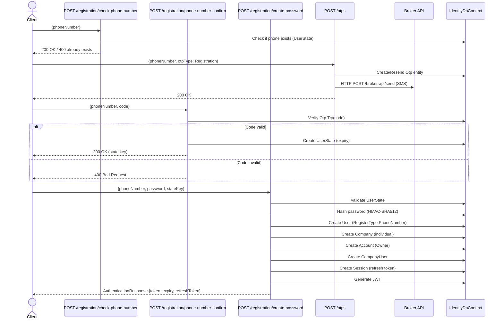

---

## 2. eImzo Registration / Login Flow

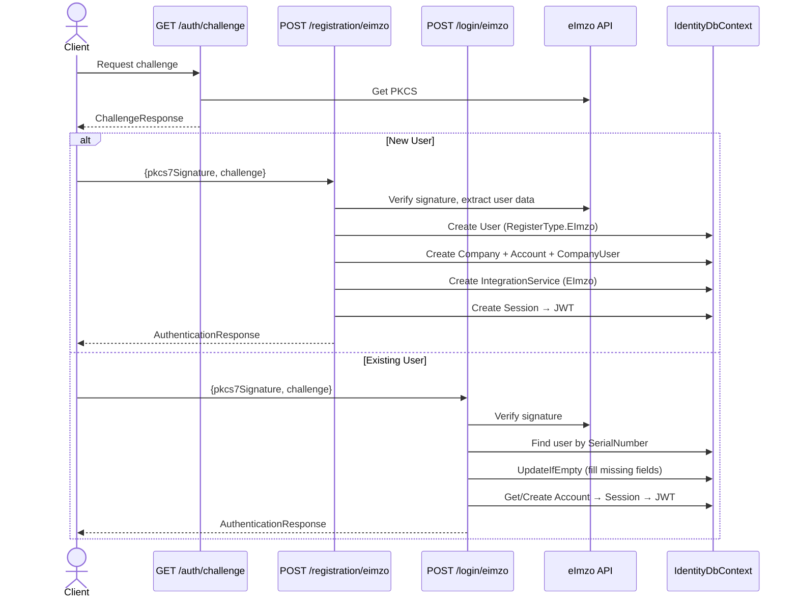

---

## 3. OneId Registration / Login Flow

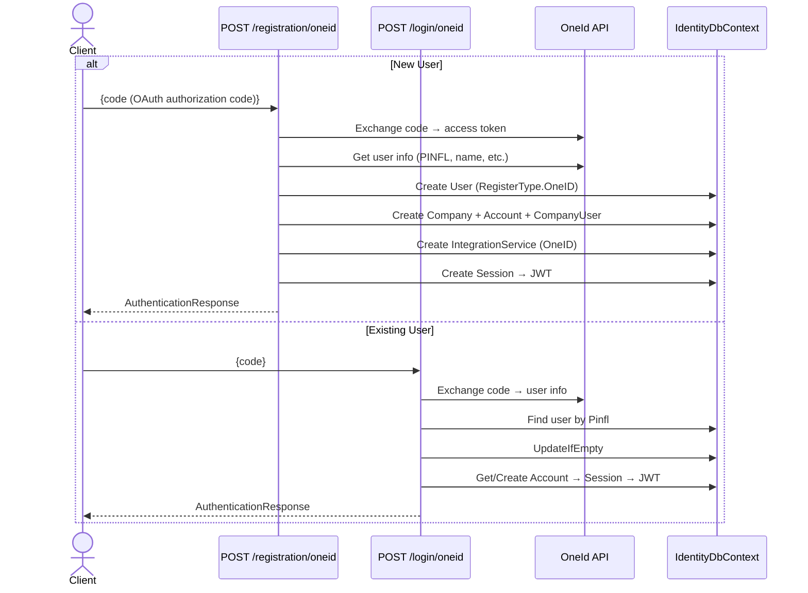

---

## 4. Phone Number Login Flow

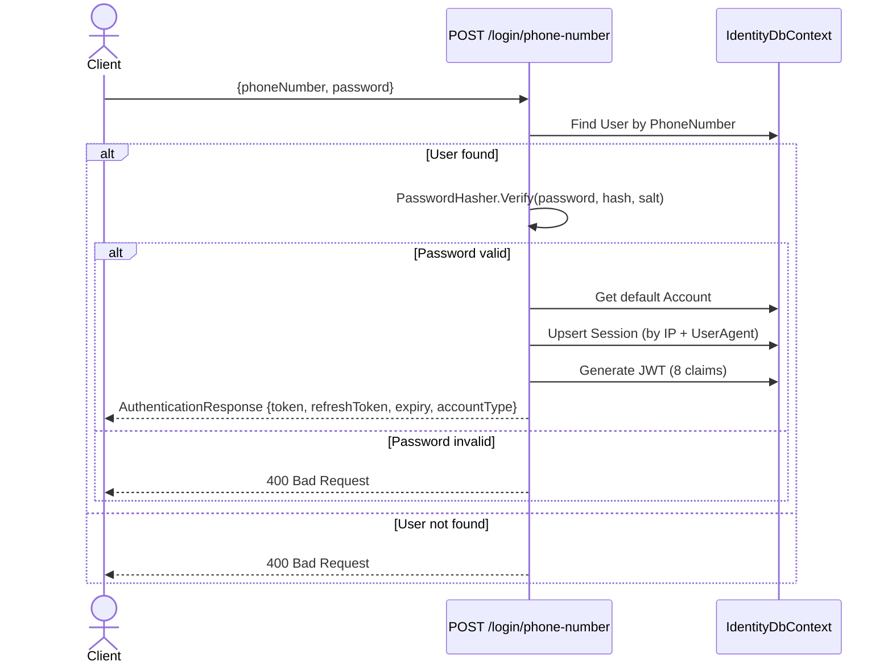

---

## 5. Token Refresh Flow

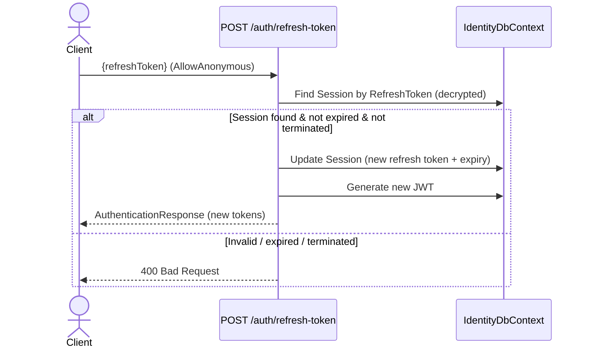

---

## 6. Logout Flow

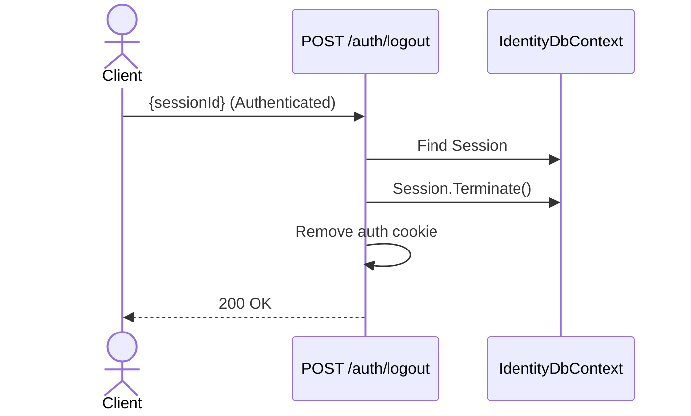

---

## 7. Forgot Password Flow

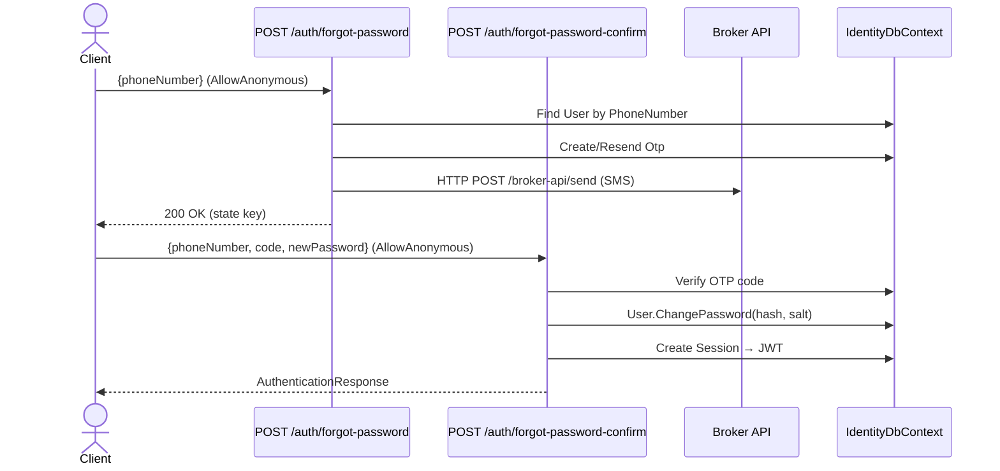

---

## 8. Account Switching Flow

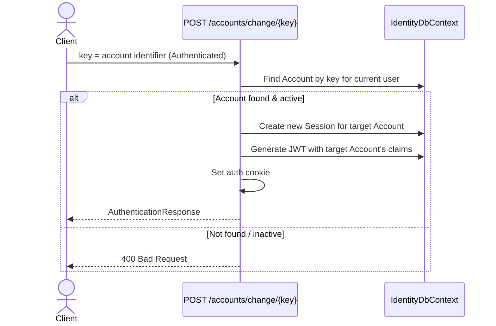

---

## 9. Invitation Lifecycle Flow

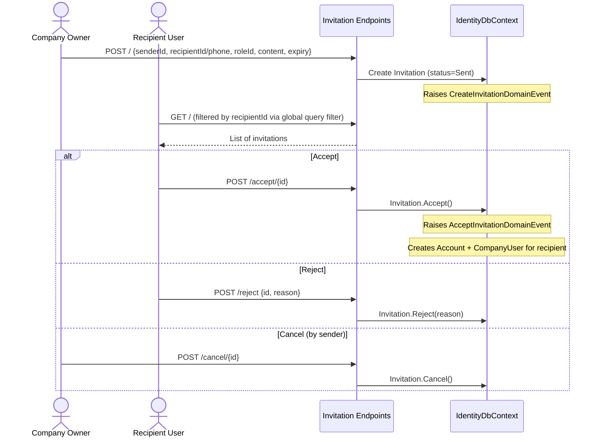

---

## 10. Account Creation Flow (Owner / Client)

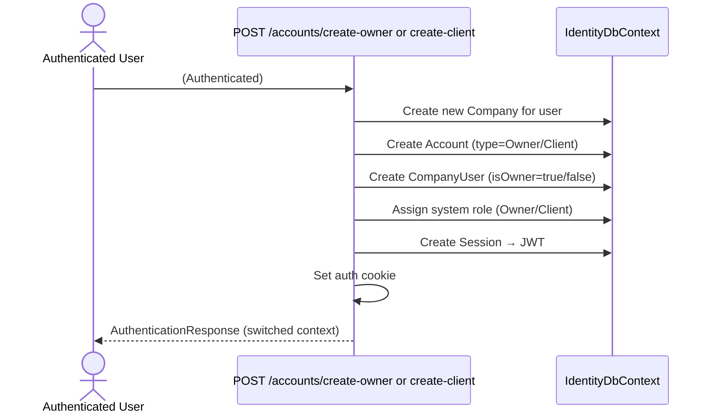

---

## 11. Binding Flow (eImzo / OneId)

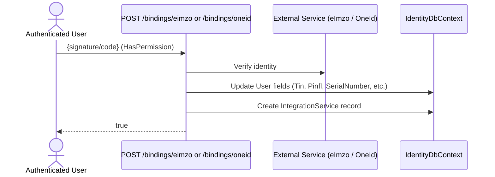

---

## API Endpoint Catalog

### Authentication Group (`/auth`) — AllowAnonymous unless noted

| Method | Route | Handler | Auth |
|---|---|---|---|
| `GET` | `/challenge` | `GetEImzoChallengeQueryHandler` | Anonymous |
| `POST` | `/logout` | `LogoutCommandHandler` | **Authenticated** |
| `POST` | `/refresh-token` | `RefreshTokenCommandHandler` | Anonymous |
| `POST` | `/forgot-password` | `PhoneNumberForgotPasswordCommandHandler` | Anonymous |
| `POST` | `/forgot-password-confirm` | `PhoneNumberForgotPasswordConfirmCommandHandler` | Anonymous |
| `POST` | `/eimzo-mobile` | `EImzoMobileAuthCommandHandler` | Anonymous |

### Login Group (`/login`) — All AllowAnonymous

| Method | Route | Handler |
|---|---|---|
| `POST` | `/phone-number` | `PhoneNumberLoginCommandHandler` |
| `POST` | `/oneid` | `OneIdLoginCommandHandler` |
| `POST` | `/eimzo` | `EImzoLoginCommandHandler` |
| `POST` | `/eimzo-mobile` | `EImzoMobileLoginCommandHandler` |

### Registration Group (`/registration`) — All AllowAnonymous

| Method | Route | Handler |
|---|---|---|
| `POST` | `/check-phone-number` | `CheckPhoneNumberCommandHandler` |
| `POST` | `/phone-number-confirm` | `PhoneNumberRegistrationCommandHandler` |
| `POST` | `/create-password` | `PhoneNumberRegistrationConfirmCommandHandler` |
| `POST` | `/oneid` | `OneIdRegistrationCommandHandler` |
| `POST` | `/eimzo` | `EImzoRegistrationCommandHandler` |
| `POST` | `/eimzo-mobile` | `EImzoMobileRegistrationCommandHandler` |

### Accounts Group (`/accounts`) — Authenticated

| Method | Route | Handler | Permission |
|---|---|---|---|
| `GET` | `/my` | `GetMyAccountsQueryHandler` | — |
| `POST` | `/change/{key}` | `ChangeAccountCommandHandler` | — (commented out) |
| `POST` | `/create-owner` | `CreateOwnerAccountCommandHandler` | — (commented out) |
| `POST` | `/create-client` | `CreateClientAccountCommandHandler` | — (commented out) |
| `POST` | `/{userId}/deactivate` | `DeactivateAccountCommandHandler` | — |
| `POST` | `/{userId}/activate` | `ActivateAccountCommandHandler` | — |

### Users Group (`/users`) — Authenticated

| Method | Route | Handler | Permission |
|---|---|---|---|
| `GET` | `/` | `GetUsersQueryHandler` | `users:list` |
| `GET` | `/{id}` | `GetUserByIdQueryHandler` | `users:get-by-id` |
| `GET` | `/profile` | `ProfileQueryHandler` | — |
| `GET` | `/permissions` | `GetPermissionsQueryHandler` | — |
| `PUT` | `/profile` | `UpdateProfileCommandHandler` | — |

### Companies Group (`/companies`) — Authenticated

| Method | Route | Handler | Permission |
|---|---|---|---|
| `GET` | `/` | `GetCompaniesQueryHandler` | — |
| `GET` | `/{id}` | `GetCompanyByIdQueryHandler` | `companies:get-by-id` |
| `PUT` | `/logo` | `UpdateCompanyLogoCommandHandler` | `companies:logo` |
| `DELETE` | `/{id}` | `RemoveCompanyCommandHandler` | `companies:remove` |
| `GET` | `/users` | `GetCompanyUsersQueryHandler` | — |

### Invitations Group (`/invitations`) — Authenticated + RBAC

| Method | Route | Handler | Permission |
|---|---|---|---|
| `GET` | `/` | `GetInvitationsQueryHandler` | `invitations:list` |
| `GET` | `/{id}` | `GetInvitationByIdQueryHandler` | `invitations:get-by-id` |
| `POST` | `/` | `CreateInvitationCommandHandler` | `invitations:create` |
| `PUT` | `/` | `UpdateInvitationCommandHandler` | `invitations:update` |
| `DELETE` | `/{id}` | `RemoveInvitationCommandHandler` | `invitations:remove` |
| `POST` | `/accept/{id}` | `AcceptInvitationCommandHandler` | `invitations:update` |
| `POST` | `/cancel/{id}` | `CancelInvitationCommandHandler` | `invitations:update` |
| `POST` | `/reject` | `RejectInvitationCommandHandler` | `invitations:update` |

### OTPs Group (`/otps`)

| Method | Route | Handler | Auth |
|---|---|---|---|
| `POST` | `/` | `SendOtpCommandHandler` | Anonymous |

### Bindings Group (`/bindings`) — Authenticated + RBAC

| Method | Route | Handler | Permission |
|---|---|---|---|
| `POST` | `/oneid` | `OneIdBindingCommandHandler` | `bindings:one-id` |
| `POST` | `/eimzo` | `EImzoBindingCommandHandler` | `bindings:eimzo` |

---

## Session Upsert Strategy

The `BaseAuthenticationCommandHandler.UpsertSessionAsync` method implements a smart session reuse pattern:

1. **Check by SessionId** — if provided (e.g., during refresh), find the exact session
2. **Check by IP + UserAgent** — reuse existing session from same device
3. **Create new** — if no match found, create fresh session with new refresh token
4. **Update existing** — if match found, rotate refresh token and update expiry

This prevents session proliferation while still tracking unique devices.

---

## Domain Event Side Effects

| Event | Handler | Side Effect |
|---|---|---|
| `UpsertUserPostDomainEvent` | `UpsertUserPostDomainEventHandler` | Sync user to related modules |
| `DeleteUserPostDomainEvent` | `DeleteUserPostDomainEventHandler` | Cascade cleanup |
| `CreateOrUpdateCompanyPostDomainEvent` | Company event handler | Sync company data |
| `DeleteCompanyPostDomainEvent` | Company event handler | Cascade cleanup |
| `CreateAccountPreDomainEvent` | `CreateHostAccountPreDomainEventHandler` / `CreatetAccountPreDomainEventHandler` | Initialize account type-specific setup |
| `DefaultAccountPreDomainEvent` | `DefaultAccountPreDomainEventHandler` | Remove previous default flag |
| `DeleteAccountPreDomainEvent` | `DeleteAccountPreDomainEventHandler` | Terminate sessions, cleanup accounts |
| `AcceptInvitationDomainEvent` | Application handler | Create CompanyUser + Account for accepted invite |
| `UpsertCompanyUserPostDomainEvent` | CompanyUser event handler | Sync to related entities |
| `DeleteCompanyUserPostDomainEvent` | CompanyUser event handler | Cascade cleanup |
| `CreateOrUpdateRolePostDomainEvent` | Role event handler | Sync role permissions |
| `DeleteRolePostDomainEvent` | Role event handler | Cascade cleanup |
| `RemoveMainBankPropertyDomainEvent` | BankProperty event handler | Auto-promote next bank property to main |
